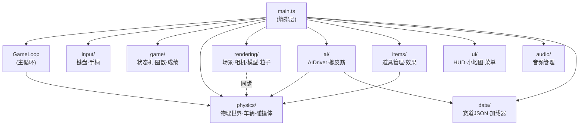
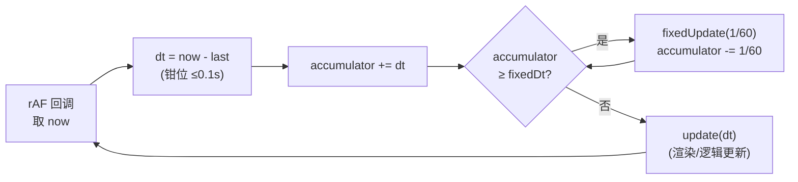
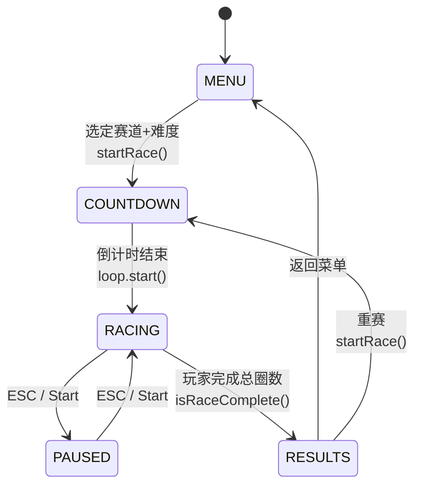
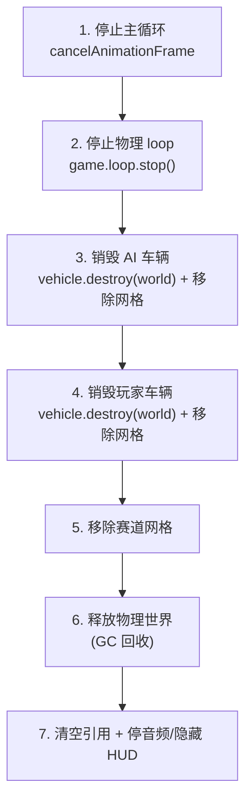
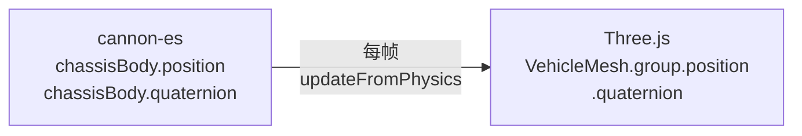

# 01 — 架构总览

> 本篇描述 Just For Speed 的整体分层结构、主循环设计与游戏状态机。理解本篇是阅读其余各篇的基础。

## 1. 设计目标与技术栈

游戏定位为**街机娱乐性**赛车（灵活转向、易漂移、强反馈），而非拟真模拟。这一基调决定了以下技术取舍：

| 层面 | 选型 | 选型理由 |
|------|------|---------|
| 渲染 | Three.js ^0.184 | 浏览器 3D 事实标准，生态成熟 |
| 物理 | cannon-es ^0.20 | 提供 `RaycastVehicle`，适合街机车辆；纯 JS 无 WASM 依赖 |
| 构建 | Vite ^8 | 原生 ESM、HMR 快，支持 JSON 动态 import 加载赛道 |
| 语言 | TypeScript ^6（strict） | 类型安全；模块边界靠类型约束 |
| 音频 | Web Audio API | 程序化合成音效，无需音频资源文件 |
| 输入 | Keyboard + Gamepad API | 手柄通过摇杆提供模拟量，键盘提供数字量 |
| 持久化 | localStorage | 轻量、无后端依赖 |

## 2. 分层架构

整个系统由 `src/main.ts` 作为**唯一顶级编排文件**串联。各子系统位于独立目录，通过明确接口通信。



**关键依赖方向约定（避免循环依赖）：**

- 物理层（`physics/`）是**最底层**，不依赖渲染、AI、UI。它只暴露 cannon-es 的位置/四元数。
- 渲染层（`rendering/`）单向**读取**物理层的结果（位置/四元数同步），不写回物理状态。
- AI 层（`ai/`）依赖物理层（复用 `Vehicle`）和赛道层（读取曲线），产出「假输入」喂给物理车辆。
- 所有跨子系统的协调都集中在 `main.ts`，子系统之间**不直接互调**。

## 3. 主循环设计

主循环是引擎的心脏。本游戏采用**固定步长物理 + 可变步长渲染**的经典模式（fixed timestep with accumulator）。

### 3.1 两个循环

| 循环 | 驱动 | 频率 | 职责 |
|------|------|------|------|
| `GameLoop.loop()` | `requestAnimationFrame` | 可变（~60Hz） | 物理步进 + Updatable 更新 |
| `renderLoop()`（main.ts） | `requestAnimationFrame` | 可变 | 输入、AI、HUD、网格同步、相机、渲染 |

> 注意：`GameLoop` 内部其实也调用 rAF，但它只负责**物理子系统的 `fixedUpdate`**；而 `main.ts` 的 `renderLoop` 负责把玩家输入、AI、HUD、网格同步等「游戏逻辑」跑起来并最终渲染。两者并行运行，各自独立调度。

### 3.2 固定步长累加器（accumulator）原理

物理模拟对时间步长敏感：同一辆车在 30Hz 和 60Hz 下行为会不同，导致「高刷屏跑得更快」等 bug。固定步长解决此问题——物理永远以 `1/60` 秒为步长推进，**与帧率解耦**。



核心实现（`src/game/GameLoop.ts`）：

```ts
private readonly fixedDt: number = 1 / 60;

private loop(): void {
  this.animationId = requestAnimationFrame(this.loop.bind(this));
  const now = performance.now();
  let dt = (now - this.lastTime) / 1000;
  this.lastTime = now;
  if (dt > 0.1) dt = 0.1;              // ① 帧间 dt 钳位
  this.accumulator += dt;
  while (this.accumulator >= this.fixedDt) {
    for (const sys of this.updatables) sys.fixedUpdate(this.fixedDt);
    this.accumulator -= this.fixedDt;   // ② 消耗固定步长
  }
  for (const sys of this.updatables) sys.update(dt, now / 1000);
}
```

**两个关键细节：**

- **① `dt > 0.1` 钳位**：标签页切到后台时 rAF 会暂停，切回时 `dt` 可能很大（数秒）。不钳位会导致一个帧内跑几百次物理步进，车辆瞬间飞出去。钳到 0.1s 是「宁可画面卡一下，也不要状态爆炸」。
- **② while 消耗**：若一帧实际耗时超过 1/60（如掉帧到 30Hz），accumulator 会在下一帧跑**两次** `fixedUpdate` 补偿，保证物理「总时间」不落后。

### 3.3 Updatable 接口

所有进入主循环的系统都实现 `Updatable` 接口，区分两种更新：

```ts
export interface Updatable {
  update(dt: number, totalTime: number): void;   // 可变步长，用于非物理逻辑
  fixedUpdate(dt: number): void;                  // 固定步长，仅物理
}
```

目前只有 `PhysicsWorld` 真正使用 `fixedUpdate`（调用 `world.step(dt)`）。其余系统（如 AI、HUD）由 `main.ts` 的 `renderLoop` 直接驱动，而非通过 `GameLoop.addSystem`。

## 4. 游戏状态机

`GameManager` 持有一个 `GameState`，其核心是 `phase` 字段。状态机决定了「此刻哪些系统该更新」。



各阶段的系统行为：

| 阶段 | 物理 loop | 渲染 loop 的逻辑更新 | 说明 |
|------|----------|-------------------|------|
| MENU | 未启动 | 仅渲染空场景 | `menuRenderLoop` 保持背景渲染 |
| COUNTDOWN | 未启动 | 渲染但冻结输入 | 倒计时 3→2→1→GO，每秒一次 |
| RACING | 启动 | 全系统更新 | 玩家输入、AI、圈数、道具、HUD 全开 |
| PAUSED | **停止** | 早退（不更新逻辑） | `renderLoop` 检测到 PAUSED 直接 return，物理 loop 已 `stop()` |
| RESULTS | 停止 | 停止 | 展示结算，等待重赛/返回 |

> **渲染与物理解耦的体现**：暂停时物理 loop 被 `stop()`，但渲染 loop 仍在跑（只是 `renderLoop` 在 PAUSED 分支提前 return）。这意味着暂停期间画面不更新，恢复时无缝衔接。

## 5. 生命周期管理

`main.ts` 把所有状态分为两类，这是理解资源管理的关键：

### 5.1 持久单例（survive restarts）

```ts
const scene = new Scene();          // Three.js 场景，跨对局复用
const environment = new Environment(scene.threeScene);
const input = new InputManager();    // 输入监听器，只绑一次
const scoreManager = new ScoreManager(); // localStorage 读写器
```

这些在模块加载时创建一次，对局重启不销毁——避免重复创建 WebGL 上下文、重复绑定事件监听。

### 5.2 赛局作用域状态（cleaned between races）

```ts
let physics: PhysicsWorld | null = null;
let playerVehicle: Vehicle | null = null;
let aiDrivers: AIDriver[] = [];
// ... 其余均为 null 初始化
```

每次 `startRace()` 先调 `cleanupRace()` 全部销毁，再按新赛道/难度重建。这种「一次性变量 + null 守卫」是 `main.ts` 的一大风格特征。

### 5.3 `cleanupRace()` 的销毁顺序

销毁顺序有讲究，避免悬空引用：



`Vehicle.destroy()` 同时从物理世界移除 `RaycastVehicle` 和 chassis body，并清理 `setTimeout` 句柄（防止已销毁车辆触发回调）。

## 6. 物理-渲染解耦

物理（cannon-es）和渲染（Three.js）是完全独立的两套数学库，通过**每帧位置/四元数拷贝**同步：



```ts
// main.ts renderLoop 中，每帧同步
const pos = playerVehicle.getPosition();        // cannon Vec3
const quat = playerVehicle.getQuaternion();     // cannon Quaternion
playerVehicleMesh.updateFromPhysics(pos, quat); // 拷贝到 Three.js Object3D
```

这种单向数据流（物理 → 渲染，绝不反向）的好处：物理状态永远权威，渲染只是「显示」，调试时可单独暂停渲染而不影响物理。

## 7. 小结

| 设计决策 | 解决的问题 |
|---------|-----------|
| 固定步长累加器 | 高/低刷新率下物理行为一致 |
| dt 钳位 0.1s | 后台标签页切回不爆状态 |
| 持久单例 vs 赛局作用域 | 避免重复创建重资源，又能干净重开 |
| 物理-渲染单向同步 | 物理权威，渲染可独立调试 |
| 唯一编排文件 main.ts | 跨系统协调集中可见，子系统不互相耦合 |

后续各篇将深入具体子系统。建议接着读 [02 物理模型](./02-physics.md)。
