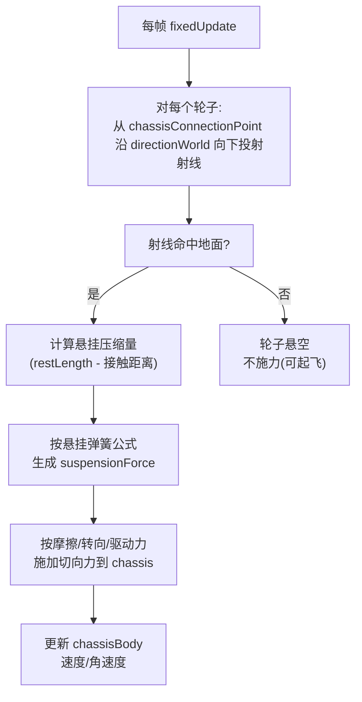
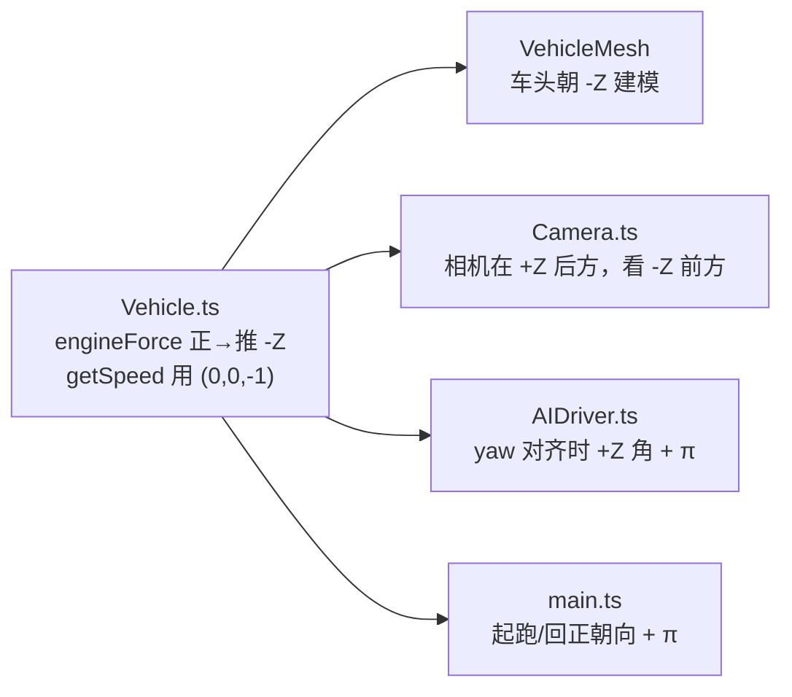
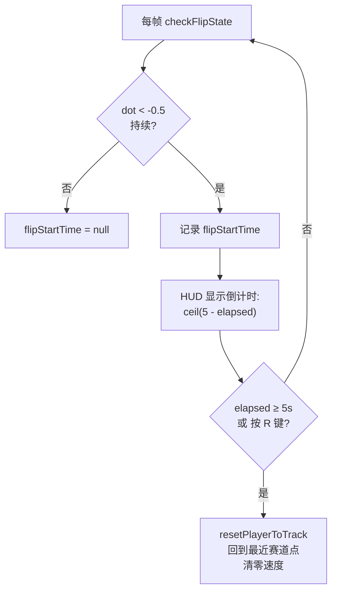

# 02 — 物理模型

> 本篇记录车辆物理的核心算法。物理是赛车游戏的灵魂，本篇也是全文技术含量最高的一篇。
>
> 涉及文件：`src/physics/PhysicsWorld.ts`、`src/physics/Vehicle.ts`、`src/physics/TrackCollider.ts`

## 1. 物理世界配置

`PhysicsWorld` 是 cannon-es `World` 的薄封装。

```ts
this.world = new CANNON.World({ gravity: new CANNON.Vec3(0, -9.82, 0) });
this.world.broadphase = new CANNON.SAPBroadphase(this.world);
this.world.allowSleep = false;
this.world.defaultContactMaterial.friction = 0.3;
this.world.defaultContactMaterial.restitution = 0.1;
```

| 配置 | 值 | 含义 |
|------|-----|------|
| `gravity` | `(0, -9.82, 0)` | 真实地球重力，单位 m/s² |
| `broadphase` | `SAPBroadphase` | Sweep-and-Prune 粗检测，比 NaiveBroadphase 在物体多时更快 |
| `allowSleep` | `false` | 禁用休眠。赛车始终在动，休眠会让停止的车「冻结」导致重启异常 |
| `friction`（默认接触） | `0.3` | 物体间默认摩擦系数 |
| `restitution`（默认接触） | `0.1` | 默认弹性（接近 0，几乎不反弹） |

物理步进由主循环以固定 `1/60` 步长调用 `world.step(dt)`（见 [01 架构总览 §3](./01-architecture.md)）。

## 2. RaycastVehicle 原理

cannon-es 提供两种车辆模型，本项目选 `RaycastVehicle`：

| 模型 | 原理 | 优缺点 |
|------|------|--------|
| `RigidVehicle`（未用） | 用真实约束（HingeConstraint）连接轮子 | 稳定性差，高速易抖 |
| **`RaycastVehicle`（采用）** | 每帧从轮子连接点**向下投射射线**，命中地面后计算悬挂力与摩擦力 | 稳定、可调参、无穿模；轮子本身不是物理刚体 |

### 射线投射车辆的工作流程



关键：**轮子不是独立刚体**，而是「射线探测器」。这意味着轮子不会和别的物体发生碰撞——它们只负责探测地面并把力施加到底盘上。

### 车辆坐标系配置

```ts
this.raycastVehicle = new CANNON.RaycastVehicle({
  chassisBody: this.chassisBody,
  indexRightAxis: 0,   // X 轴 = 右
  indexUpAxis: 1,      // Y 轴 = 上
  indexForwardAxis: 2, // Z 轴 = 前
});
```

这里设定「前向 = Z 轴」。但**实际前向是 -Z**——这是本项目最关键的非平凡约定，见 §4。

## 3. 车辆配置参数

车辆由 `VehicleConfig` 配置，参数化注入便于调参与 AI 复用。

### 3.1 整车参数（`DEFAULT_VEHICLE_CONFIG`）

| 参数 | 值 | 含义 | 调参影响 |
|------|-----|------|---------|
| `mass` | `1200` | 底盘质量 (kg) | 越大越「重」，惯性大但引擎力也按比例放大 |
| `maxSpeed` | `200/3.6 ≈ 55.56` | 最高速 (m/s，即 200 km/h) | 软上限，最后 25% 动力线性衰减 |
| `acceleration` | `25` | 加速度基值 | 推力 = `acceleration × mass × 0.4`（≈1g） |
| `brakeForce` | `40` | 手刹制动力基值 | Space 手刹时施加到轮子 |
| `steerSpeed` | `2.5` | 转向插值速率 | 越大转向越灵敏 |
| `driftFactor` | `0.3` | 手刹时后轮抓地比率 | 后轮 frictionSlip × 0.3 → 甩尾 |
| `boostMultiplier` | `1.5` | 加速道具时的最高速/引擎力倍率 | 3 秒加速期间生效 |

### 3.2 轮子/悬挂参数（`WHEEL_OPTIONS`）

这组常量直接决定手感，调参时最常改：

| 参数 | 值 | 含义 |
|------|-----|------|
| `radius` | `0.35` | 轮子半径 (m) |
| `suspensionStiffness` | `30` | 悬挂弹簧刚度。越大越硬，车身越不晃但易颠 |
| `suspensionRestLength` | `0.4` | 悬挂静息长度 (m)。静止压缩量 ≈ g/(4×刚度) ≈ 0.08 m |
| `frictionSlip` | `2.5` | 轮胎摩擦（摩擦圆上限）。越大越抓地、越难漂移 |
| `dampingRelaxation` | `2.3` | 悬挂回弹阻尼（拉伸时） |
| `dampingCompression` | `4.4` | 悬挂压缩阻尼（压缩时，通常大于 relaxation） |
| `maxSuspensionForce` | `100000` | 单轮悬挂力上限，防极端值 |
| `rollInfluence` | `0.01` | 摩擦力对侧倾的贡献。越小越不易翻车 |
| `maxSuspensionTravel` | `0.5` | 悬挂最大行程 (m) |

### 3.3 四轮布局与底盘碰撞盒

```ts
const WHEEL_POSITIONS = [
  new CANNON.Vec3(-0.8, 0, -1.2),  // FL 前左（前轴 = 车头 -Z，转向轮）
  new CANNON.Vec3(0.8, 0, -1.2),   // FR 前右
  new CANNON.Vec3(-0.8, 0, 1.2),   // RL 后左（后轴 = 车尾 +Z，驱动轮）
  new CANNON.Vec3(0.8, 0, 1.2),    // RR 后右
];
```

- 底盘形状：`Box(0.68, 0.4, 1.55)` —— 宽 1.36 m、高 0.8 m、长 3.1 m（半值），**对齐视觉车身（1.5 × 3.4 m）**，撞墙时碰撞的就是你看到的车身。加长的箱体同时把俯仰/偏航惯量提升到 ~1000 kg·m²，是抑制翘头的第一道防线。
- 前轮（index 0, 1）负责**转向**；后轮（index 2, 3）负责**驱动**（后驱）。

## 4. 坐标与朝向约定（⭐ 核心难点）

**这是全项目最容易踩坑的地方**：车辆的实际前向是**局部 -Z**，而非 +Z。这个约定贯穿物理、渲染、相机、AI 四层，必须保持一致。

### 4.1 为什么是 -Z？

**历史起源**（旧版驱动走 cannon 的 `applyEngineForce` 时）：在 `indexForwardAxis=2`（Z 轴）+ `axleLocal=(-1,0,0)`（轮轴沿 -X）的组合下，cannon-es 的正 engineForce 实际把底盘推向局部 -Z——这个隐式行为决定了最初的朝向约定。

**现状**（提交 `77adeab` 车辆重做之后）：驱动不再走 `applyEngineForce`（见 §5.2 的质心施力），-Z 约定由代码**显式写明**、不再依赖 cannon 的隐式行为：

```ts
// Vehicle.ts —— 前向常量是 -Z 约定的现锚点
const FORWARD = new CANNON.Vec3(0, 0, -1);

// applyDriveThrust()：推力沿车头方向（局部 -Z 旋到世界坐标）、施加于质心
this.chassisBody.quaternion.vmult(FORWARD, this.tmpVecA);
this.chassisBody.applyForce(...);
```

轮距布局同样遵守该约定：**转向轮（index 0/1）必须坐在 -Z 端（车头）**——`setSteeringValue` 只打在前两个轮上，若转向轮在车尾则车无法转向（源码注释记录了早期这个 bug）。

### 4.2 -Z 约定的全链路一致性

这个约定在四个地方必须对齐，否则车辆「乱开」：



#### getSpeed() 的前向计算

```ts
getSpeed(): number {
  const vel = this.chassisBody.velocity;
  const forward = new CANNON.Vec3(0, 0, -1);   // 局部前向 = -Z
  const worldQuat = this.chassisBody.quaternion;
  worldQuat.vmult(forward, forward);            // 旋到世界坐标
  return vel.dot(forward);                       // 速度在前向上的投影
}
```

- 前进（沿 -Z）返回**正值**；倒车返回负值。
- 这让 `input.forward && speed < maxSpeed` 这样的速度上限判断语义正确。

#### 起跑朝向（main.ts）

赛道切线给出的是「行进方向」。要把车头（-Z）对齐到该方向：

```ts
// atan2(tangent.x, tangent.z) 让局部 +Z 朝向切线方向；
// 加 π 翻转，让 -Z（车头）朝向切线。
const startAngle = Math.atan2(startTangent.x, startTangent.z) + Math.PI;
playerVehicle.chassisBody.quaternion.setFromEuler(0, startAngle, 0);
```

> **历史教训**：提交 `f0be453 修改车辆行驶方向不一致的问题` 正是修复这个 π 偏移，让车头、相机、行进方向三者统一。

## 5. 输入 → 物理映射

`updateFromInput()` 每帧把 `InputState` 转成 cannon-es 的车辆控制量。

### 5.1 转向（平滑插值 + 速度感应）

转向输入先向目标值**线性插值**（模拟方向盘手感），再按当前速度映射成实际前轮转角：

```ts
const steerRate = this.config.steerSpeed * steerMultiplier; // 手刹时 ×1.4
// ... currentSteer 向 targetSteer（[-1,1]）插值 ...

// 速度感应：静止满舵 0.55 rad，最高速收窄到 0.16 rad
const speedNorm = Math.min(Math.abs(speed) / this.currentMaxSpeed, 1);
const maxSteer = MAX_STEER_LOW + (MAX_STEER_HIGH - MAX_STEER_LOW) * speedNorm;
this.raycastVehicle.setSteeringValue(-this.currentSteer * maxSteer, 0); // FL
this.raycastVehicle.setSteeringValue(-this.currentSteer * maxSteer, 1); // FR
```

- **速度感应转向**是街机手感的基石：同样的按键行程，低速是掉头满舵，高速只是轻拨方向——消除高速一把方向就甩出去的「神经质」。
- **前轮转向**：仅前两轮偏转，后轮固定。过弯时车头先转、车尾跟随，手感稳定易预判。
- **手刹时 ×1.4 转向倍率**：漂移中需要更快的方向变化。
- 优先用**模拟量** `input.steerX`（手柄摇杆），键盘数字量（-1/0/+1）作回退。
- 符号取负的原因见源码注释（`axleLocal=(-1,0,0)` + 前轴在 -Z 端的坐标系组合）。

### 5.2 驱动（质心施力，杜绝翘头）

驱动推力**不再**走 cannon 的 `applyEngineForce`（其冲量施加在轮胎接地点，低于质心 ~0.67 m，满油门会产生 ~8000 N·m 的翘头力矩——实测 0.3 秒前轮离地、0.6 秒后空翻，且悬挂离地余量仅 ~0.08 m，前轮一旦悬空便无可挽回）。改为在**质心**沿车头方向直接施力：

```ts
const DRIVE_COEFF = 0.4;   // 推力 = 25 × 1200 × 0.4 ≈ 12 kN ≈ 1g
let engineForce = 0;
if (input.forward) {
  if (speed < -BRAKE_TO_REVERSE_SPEED) serviceBrake = SERVICE_BRAKE; // 倒滑中 W=刹车
  else if (speed < effectiveMaxSpeed) {
    // 最后 25% 最高速区间动力线性衰减，避免硬切造成的顿挫
    const taper = Math.min((1 - speedRatio) / 0.25, 1);
    engineForce = this.config.acceleration * this.config.mass * DRIVE_COEFF * taper;
    if (isBoosted) engineForce *= this.config.boostMultiplier;
  }
}
this.pendingThrust = engineForce; // world 'preStep' 每物理步施加（帧率无关）
```

- **质心施力零俯仰力矩**：起步再猛也不会翘头/后翻，boost 全开同理。
- **接地缩放**：按 `numWheelsOnGround / 4` 缩放，落地过程牵引力渐进恢复；悬空无推力。
- **preStep 施加**：`world.step` 每步清空 `body.force`，若在渲染帧施力，低帧率下推力会按比例缩水。监听 world `preStep` 事件保证每个固定步都吃到满推力。
- 倒车力系数 0.12，最高速受限 30%。
- 轮子的滚动动画不依赖引擎力：cannon 按实际地面速度累计 `deltaRotation`。

### 5.3 制动（S/↓ 刹车优先，Space 手刹甩尾）

```ts
// S/↓ 在前进中 = 服务刹车（前 100% / 后 70%，前刹偏重保直线稳定）
// 速度降到 0.5 m/s 以下才切换为倒车推力 —— 街机标准的「先刹后倒」
serviceBrake = SERVICE_BRAKE; // 90 N·s/轮

// Space = 手刹（前 60% / 后 100%，后轮先锁 → 甩尾）
handbrakeBrake = this.config.brakeForce; // 40
this.raycastVehicle.setBrake(Math.max(serviceBrake, handbrakeBrake * 0.6), 0); // FL
this.raycastVehicle.setBrake(Math.max(serviceBrake, handbrakeBrake * 0.6), 1); // FR
this.raycastVehicle.setBrake(Math.max(serviceBrake * 0.7, handbrakeBrake), 2); // RL
this.raycastVehicle.setBrake(Math.max(serviceBrake * 0.7, handbrakeBrake), 3); // RR
```

### 5.4 漂移（手刹收后轮摩擦圆 + 真实侧滑检测）

**物理**：手刹按下时把后轮 `frictionSlip` 从 2.5 砍到 `2.5 × driftFactor(0.3) = 0.75`。cannon 的摩擦圆 `maximp = suspensionForce × dt × frictionSlip` 随之收缩，后轮承受不了过弯侧向载荷 → 车尾甩出。松开即恢复满抓地。`driftFactor` 终于有了用武之地。

**检测**（驱动烟雾/音效，不改物理）：

```ts
const slipAngle = Math.atan2(|横向速度|, |纵向速度|);  // 车体坐标系分解
isDrifting = (手刹 && |speed| > 5) || (|speed| > 8 && slipAngle > 0.35 rad);
```

基于**真实侧滑角**而非「手刹是否按下」——高速急转突破后轮抓地的甩尾同样触发漂移特效；实测 105 km/h、47° 侧滑时正确置位，抓地拉直后自动复位。

## 6. 特殊状态机制

### 6.1 加速（Boost）—— 时间戳机制

```ts
applyBoost(duration: number): void {
  this.boostEndTime = performance.now() / 1000 + duration;
}
// 每帧判断
const isBoosted = now < this.boostEndTime;
```

用「结束时间戳」而非「剩余秒数计数器」——好处是**无需每帧递减**，且天然抗暂停误差（暂停期间 `now` 不走，恢复后剩余时间不变）。加速道具持续 3 秒。

### 6.2 减速（Speed Reduction）—— setTimeout 恢复

```ts
applySpeedReduction(factor: number, duration: number): void {
  this.currentMaxSpeed = this.config.maxSpeed * factor;
  this.speedReductionTimer = setTimeout(() => {
    this.currentMaxSpeed = this.config.maxSpeed;
  }, duration * 1000);
}
```

被炸弹道具命中时 `factor=0.5`，持续 2 秒。用 `setTimeout` 而非时间戳——因为减速要恢复 `maxSpeed`，需要一个明确的「到期动作」。注意 `destroy()` 会 `clearTimeout` 防止已销毁车辆触发回调。

### 6.3 空气动力学与空中控制

```ts
// 接地时：下压力 ∝ v²（部分接地按比例缩放），沿车体 -Y 方向
const down = DOWNFORCE_COEFF * v * v * (groundedWheels / 4);   // 3.0 × v²
// 车身倾斜 > 60° 时跳过——翻滚中的「车轴下压力」会变成侧推、火上浇油

// 悬空时：绕车体 up 轴的小偏航力矩（1500 N·m），让玩家在空中摆正车头落地
applyTorque(upWorld * (-currentSteer * AIR_YAW_TORQUE));
```

下压力把高速抓地「焊」回路面，同时压住抬头趋势——这是角阻尼能从 0.8（旧版压制弹跳/翘头的 hack，副作用是车身姿态僵硬）降到 0.6 的前提。

### 6.4 卡死自动脱困

顶墙场景（车头垂直抵住护栏夹角）里推力与墙面法向力精确平衡，车会原地不动——翻车回正覆盖不了这种「直立卡死」。检测：**油门踩着但 `|speed| < 0.5 m/s` 持续 1.5 秒** → 玩家调用 `resetPlayerToTrack`（回最近赛道点），AI 调用 `setPosition(waypointProgress)`。油门松开或恢复移动即重新计时。

### 6.5 翻车检测与自动回正（⭐）

这是提交 `d27bdca 添加车辆翻车后回正功能` 的核心。

**翻车判定**：车辆局部上方向 `(0,1,0)` 经四元数旋到世界坐标后，与世界 Y 轴 `(0,1,0)` 做点积。

```ts
checkFlipState(): void {
  const upLocal = new CANNON.Vec3(0, 1, 0);
  const upWorld = new CANNON.Vec3();
  this.chassisBody.quaternion.vmult(upLocal, upWorld);
  const dot = upWorld.dot(new CANNON.Vec3(0, 1, 0));
  const flipped = dot < FLIP_THRESHOLD;  // FLIP_THRESHOLD = -0.5
  // 记录翻车开始时间 ...
}
```

**点积的几何含义：**

| `dot` 值 | 车辆姿态 | 判定 |
|----------|---------|------|
| `1.0` | 完全正立 | 正常 |
| `0` | 侧翻 90° | 正常（阈值宽松） |
| `-0.5` | 翻转 120° | **临界，开始计为翻车** |
| `-1.0` | 完全倒置（车顶朝下） | 翻车 |

阈值用 `-0.5` 而非 `0`：允许侧倾一定角度不算翻车，避免擦碰护栏误触发。

**回正流程**（在 main.ts 编排）：



- **玩家与 AI 都适用**：玩家可按 R 键（`resetVehicle`）立即回正，不必等满 5 秒。
- AI 复用同一套 `checkFlipState`，但只等 2 秒（`AI_FLIP_RESET_DELAY`，`AIDriver.ts`）——AI 没有操作技巧，快速恢复以保持比赛流畅。AI 回正调用的是 `setPosition(waypointProgress)`（传送回自己的理想进度点，见 [03 §1](./03-ai-opponents.md)），而非玩家的 `resetPlayerToTrack`。

### 6.6 护栏接触材质（刮蹭不绊翻）

护栏与车体使用专用 `ContactMaterial`（摩擦 0.05、弹性 0.1，定义在 `PhysicsWorld.ts`）。默认摩擦 0.3 时，撞击瞬间护栏会「咬住」车身侧面引发滚转——即使用了低 `rollInfluence`，碰撞求解器的接触冲量照样能把车掀翻。低摩擦对让撞击变成顺滑的刮蹭滑行。

## 7. 小结

| 机制 | 实现要点 |
|------|---------|
| 车辆模型 | RaycastVehicle，射线探测地面，稳定可调 |
| 前向约定 | 局部 **-Z**，全链路（物理/网格/相机/AI）一致 |
| 底盘碰撞盒 | 1.36×0.8×3.1 m，对齐视觉车身；惯量提升抑制翘头 |
| 转向 | 速度感应满舵（0.55→0.16 rad），仅前轮 |
| 驱动 | 质心施力（`preStep` 每步施加），零翘头力矩；末端动力线性衰减 |
| 制动 | S/↓ = 服务刹车（前刹偏重），降到 0.5 m/s 以下才倒车 |
| 漂移 | 手刹把后轮 frictionSlip ×0.3 甩尾；侧滑角 >20° 触发特效 |
| 空气 | 下压力 ∝ v²（接地时），空中偏航力矩辅助摆正 |
| 护栏 | 专用低摩擦接触材质，刮蹭滑行不绊翻 |
| 卡死 | 油门踩着 1.5 秒不动 → 自动回赛道（玩家/AI 同套逻辑） |
| 轮子动画 | 每轮独立网格，`getWheelVisuals` 输出悬挂行程+转向+滚动 |
| 加速 | 结束时间戳，无需每帧递减 |
| 减速 | setTimeout 定时恢复，destroy 时清理 |
| 翻车 | 上方向量点积 < -0.5，玩家 5 秒 / AI 2 秒自动回正 |

赛道碰撞体（路面与护栏的物理体）见 [04 赛道系统 §5](./04-track-system.md)。AI 如何驱动车辆见 [03 AI 对手](./03-ai-opponents.md)。
