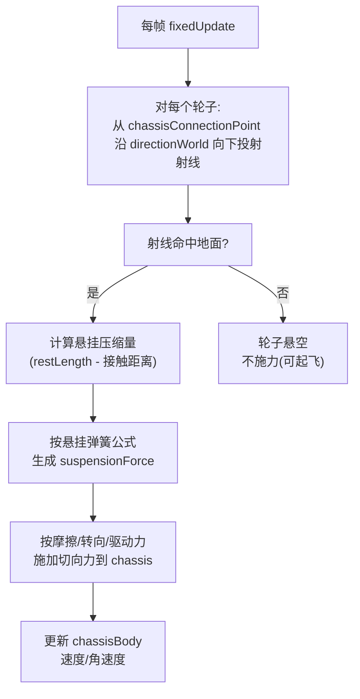
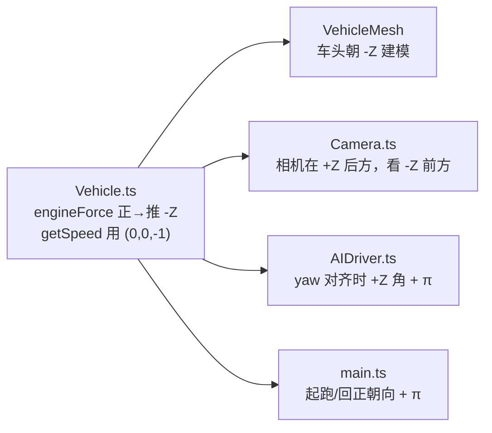
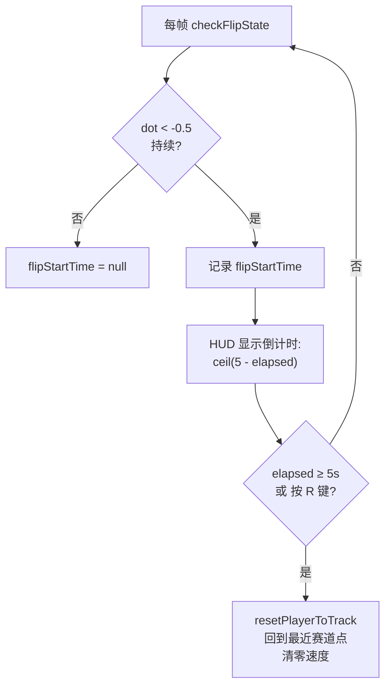

# 02 — 物理模型

> 本篇记录车辆物理的核心算法。物理是赛车游戏的灵魂，本篇也是全文技术含量最高的一篇。
>
> 涉及文件：`src/physics/PhysicsWorld.ts`、`src/physics/Vehicle.ts`、`src/physics/TrackCollider.ts`

## 1. 物理世界配置

`PhysicsWorld` 是 cannon-es `World` 的薄封装。

```ts
this.world = new CANNON.World({ gravity: new CANNON.Vec3(0, -9.82, 0) });
this.world.broadphase = new CANNON.SAPBroadphase(this.world);
this.world.allowSleep = false;
this.world.defaultContactMaterial.friction = 0.3;
this.world.defaultContactMaterial.restitution = 0.1;
```

| 配置 | 值 | 含义 |
|------|-----|------|
| `gravity` | `(0, -9.82, 0)` | 真实地球重力，单位 m/s² |
| `broadphase` | `SAPBroadphase` | Sweep-and-Prune 粗检测，比 NaiveBroadphase 在物体多时更快 |
| `allowSleep` | `false` | 禁用休眠。赛车始终在动，休眠会让停止的车「冻结」导致重启异常 |
| `friction`（默认接触） | `0.3` | 物体间默认摩擦系数 |
| `restitution`（默认接触） | `0.1` | 默认弹性（接近 0，几乎不反弹） |

物理步进由主循环以固定 `1/60` 步长调用 `world.step(dt)`（见 [01 架构总览 §3](./01-architecture.md)）。

## 2. RaycastVehicle 原理

cannon-es 提供两种车辆模型，本项目选 `RaycastVehicle`：

| 模型 | 原理 | 优缺点 |
|------|------|--------|
| `RigidVehicle`（未用） | 用真实约束（HingeConstraint）连接轮子 | 稳定性差，高速易抖 |
| **`RaycastVehicle`（采用）** | 每帧从轮子连接点**向下投射射线**，命中地面后计算悬挂力与摩擦力 | 稳定、可调参、无穿模；轮子本身不是物理刚体 |

### 射线投射车辆的工作流程



关键：**轮子不是独立刚体**，而是「射线探测器」。这意味着轮子不会和别的物体发生碰撞——它们只负责探测地面并把力施加到底盘上。

### 车辆坐标系配置

```ts
this.raycastVehicle = new CANNON.RaycastVehicle({
  chassisBody: this.chassisBody,
  indexRightAxis: 0,   // X 轴 = 右
  indexUpAxis: 1,      // Y 轴 = 上
  indexForwardAxis: 2, // Z 轴 = 前
});
```

这里设定「前向 = Z 轴」。但**实际前向是 -Z**——这是本项目最关键的非平凡约定，见 §4。

## 3. 车辆配置参数

车辆由 `VehicleConfig` 配置，参数化注入便于调参与 AI 复用。

### 3.1 整车参数（`DEFAULT_VEHICLE_CONFIG`）

| 参数 | 值 | 含义 | 调参影响 |
|------|-----|------|---------|
| `mass` | `1200` | 底盘质量 (kg) | 越大越「重」，惯性大但引擎力也按比例放大 |
| `maxSpeed` | `200/3.6 ≈ 55.56` | 最高速 (m/s，即 200 km/h) | 软上限，达到后不再加速 |
| `acceleration` | `25` | 加速度基值 | 引擎力 = `acceleration × mass × 0.5` |
| `brakeForce` | `40` | 制动力基值 | 手刹时施加到轮子 |
| `steerSpeed` | `2.5` | 转向插值速率 | 越大转向越灵敏 |
| `driftFactor` | `0.3` | 漂移因子（当前仅记录状态，未改摩擦） | 预留 |
| `boostMultiplier` | `1.5` | 加速道具时的最高速/引擎力倍率 | 3 秒加速期间生效 |

### 3.2 轮子/悬挂参数（`WHEEL_OPTIONS`）

这组常量直接决定手感，调参时最常改：

| 参数 | 值 | 含义 |
|------|-----|------|
| `radius` | `0.35` | 轮子半径 (m) |
| `suspensionStiffness` | `30` | 悬挂弹簧刚度。越大越硬，车身越不晃但易颠 |
| `suspensionRestLength` | `0.4` | 悬挂静息长度 (m) |
| `frictionSlip` | `2.5` | 轮胎摩擦。越大越抓地、越难漂移 |
| `dampingRelaxation` | `2.3` | 悬挂回弹阻尼（拉伸时） |
| `dampingCompression` | `4.4` | 悬挂压缩阻尼（压缩时，通常大于 relaxation） |
| `maxSuspensionForce` | `100000` | 单轮悬挂力上限，防极端值 |
| `rollInfluence` | `0.01` | 摩擦力对侧倾的贡献。越小越不易翻车 |
| `maxSuspensionTravel` | `0.5` | 悬挂最大行程 (m) |

### 3.3 四轮布局

```ts
const WHEEL_POSITIONS = [
  new CANNON.Vec3(-0.8, 0, 1.2),   // FL 前左
  new CANNON.Vec3(0.8, 0, 1.2),    // FR 前右
  new CANNON.Vec3(-0.8, 0, -1.2),  // RL 后左
  new CANNON.Vec3(0.8, 0, -1.2),   // RR 后右
];
```

- 底盘形状：`Box(0.5, 0.25, 1)` —— 宽 1m、高 0.5m、长 2m（半值）。
- 前轮（index 0,1）负责**转向**；后轮（index 2,3）负责**驱动**（后驱）。

## 4. 坐标与朝向约定（⭐ 核心难点）

**这是全项目最容易踩坑的地方**：车辆的实际前向是**局部 -Z**，而非 +Z。这个约定贯穿物理、渲染、相机、AI 四层，必须保持一致。

### 4.1 为什么是 -Z？

由 cannon-es 的内部约定与本项目参数组合导致：

```ts
// 轴配置：indexForwardAxis=2 (Z), axleLocal=(-1,0,0) (轮轴沿 -X)
// 在这种组合下：正的 engineForce 实际推动底盘沿局部 -Z 方向。
```

源码注释明确记录了这个非平凡事实：

> *"a POSITIVE engineForce is the only value that effectively drives the wheels... and it pushes the chassis toward local -Z. The whole project therefore treats -Z as forward."* —— `Vehicle.ts`

### 4.2 -Z 约定的全链路一致性

这个约定在四个地方必须对齐，否则车辆「乱开」：



#### getSpeed() 的前向计算

```ts
getSpeed(): number {
  const vel = this.chassisBody.velocity;
  const forward = new CANNON.Vec3(0, 0, -1);   // 局部前向 = -Z
  const worldQuat = this.chassisBody.quaternion;
  worldQuat.vmult(forward, forward);            // 旋到世界坐标
  return vel.dot(forward);                       // 速度在前向上的投影
}
```

- 前进（沿 -Z）返回**正值**；倒车返回负值。
- 这让 `input.forward && speed < maxSpeed` 这样的速度上限判断语义正确。

#### 起跑朝向（main.ts）

赛道切线给出的是「行进方向」。要把车头（-Z）对齐到该方向：

```ts
// atan2(tangent.x, tangent.z) 让局部 +Z 朝向切线方向；
// 加 π 翻转，让 -Z（车头）朝向切线。
const startAngle = Math.atan2(startTangent.x, startTangent.z) + Math.PI;
playerVehicle.chassisBody.quaternion.setFromEuler(0, startAngle, 0);
```

> **历史教训**：提交 `f0be453 修改车辆行驶方向不一致的问题` 正是修复这个 π 偏移，让车头、相机、行进方向三者统一。

## 5. 输入 → 物理映射

`updateFromInput()` 每帧把 `InputState` 转成 cannon-es 的车辆控制量。

### 5.1 转向（平滑插值）

转向不是瞬时跳变，而是向目标值**线性插值**，模拟方向盘手感：

```ts
const steerRate = this.config.steerSpeed * steerMultiplier; // 手刹时 ×1.4
if (targetSteer > this.currentSteer) {
  this.currentSteer = Math.min(this.currentSteer + steerRate * dt, targetSteer);
} else if (targetSteer < this.currentSteer) {
  this.currentSteer = Math.max(this.currentSteer - steerRate * dt, targetSteer);
}
// 只施加到前轮（index 0=FL, 1=FR）。后轮（2,3）固定，仅承载驱动力/制动力。
// （注意 ×0.5，因为 RaycastVehicle 的 steerValue 是角度，需缩放）
this.raycastVehicle.setSteeringValue(this.currentSteer * 0.5, 0); // FL
this.raycastVehicle.setSteeringValue(this.currentSteer * 0.5, 1); // FR
```

- **前轮转向**：仅前两轮偏转，后轮固定。这是常规汽车的转向方式，转向时后轮不主动改变朝向，车身围绕后轴附近旋转，过弯时车头先转、车尾跟随，手感更稳定、更易预判。
- **手刹时 ×1.4 转向倍率**：漂移时需要更快的方向变化，配合后轮锁死实现甩尾感。
- 优先用**模拟量** `input.steerX`（手柄摇杆），键盘数字量（-1/0/+1）作回退。

### 5.2 驱动力（后驱）

```ts
let engineForce = 0;
if (input.forward && speed < effectiveMaxSpeed) {
  engineForce = this.config.acceleration * this.config.mass * 0.5;
  if (isBoosted) engineForce *= this.config.boostMultiplier;
}
const maxReverseSpeed = effectiveMaxSpeed * 0.3;  // 倒车只有 30% 最高速
if (input.backward && speed > -maxReverseSpeed) {
  engineForce = -this.config.acceleration * this.config.mass * 0.15; // 倒车力小
}
// 只施加到后轮（index 2, 3）
this.raycastVehicle.applyEngineForce(engineForce, 2);
this.raycastVehicle.applyEngineForce(engineForce, 3);
```

要点：
- **速度上限是软约束**：达到 maxSpeed 后 `engineForce = 0`，靠摩擦自然减速。
- 倒车力是前进力的 0.3 倍（0.15 vs 0.5 系数），且最高速也受限。
- 加速期间 `engineForce` 和 `maxSpeed` 同步 ×1.5。

### 5.3 制动（差分制动）

手刹（Space）触发制动，但**前后轮制动力不同**：

```ts
let brakeForce = 0;
if (input.handbrake) brakeForce = this.config.brakeForce;
this.raycastVehicle.setBrake(brakeForce * 0.6, 0); // FL 60%
this.raycastVehicle.setBrake(brakeForce * 0.6, 1); // FR 60%
this.raycastVehicle.setBrake(brakeForce, 2);        // RL 100%
this.raycastVehicle.setBrake(brakeForce, 3);        // RR 100%
```

**后轮制动力更大**（100% vs 60%）→ 后轮先锁死 → 车尾失去抓地 → 形成**漂移/甩尾**。这是街机手感的来源。

### 5.4 漂移检测（状态标记，不改物理）

```ts
if (input.handbrake && Math.abs(speed) > 5) {
  this.isDrifting = true;
}
```

阈值 `|speed| > 5 m/s`（18 km/h）：低速下不判定漂移，避免起步抖动误触发。注意这**只设置状态标志**（用于触发烟雾粒子和漂移音效），漂移的物理表现完全由 §5.3 的后轮锁死实现。

## 6. 特殊状态机制

### 6.1 加速（Boost）—— 时间戳机制

```ts
applyBoost(duration: number): void {
  this.boostEndTime = performance.now() / 1000 + duration;
}
// 每帧判断
const isBoosted = now < this.boostEndTime;
```

用「结束时间戳」而非「剩余秒数计数器」——好处是**无需每帧递减**，且天然抗暂停误差（暂停期间 `now` 不走，恢复后剩余时间不变）。加速道具持续 3 秒。

### 6.2 减速（Speed Reduction）—— setTimeout 恢复

```ts
applySpeedReduction(factor: number, duration: number): void {
  this.currentMaxSpeed = this.config.maxSpeed * factor;
  this.speedReductionTimer = setTimeout(() => {
    this.currentMaxSpeed = this.config.maxSpeed;
  }, duration * 1000);
}
```

被炸弹道具命中时 `factor=0.5`，持续 2 秒。用 `setTimeout` 而非时间戳——因为减速要恢复 `maxSpeed`，需要一个明确的「到期动作」。注意 `destroy()` 会 `clearTimeout` 防止已销毁车辆触发回调。

### 6.3 翻车检测与自动回正（⭐）

这是提交 `d27bdca 添加车辆翻车后回正功能` 的核心。

**翻车判定**：车辆局部上方向 `(0,1,0)` 经四元数旋到世界坐标后，与世界 Y 轴 `(0,1,0)` 做点积。

```ts
checkFlipState(): void {
  const upLocal = new CANNON.Vec3(0, 1, 0);
  const upWorld = new CANNON.Vec3();
  this.chassisBody.quaternion.vmult(upLocal, upWorld);
  const dot = upWorld.dot(new CANNON.Vec3(0, 1, 0));
  const flipped = dot < FLIP_THRESHOLD;  // FLIP_THRESHOLD = -0.5
  // 记录翻车开始时间 ...
}
```

**点积的几何含义：**

| `dot` 值 | 车辆姿态 | 判定 |
|----------|---------|------|
| `1.0` | 完全正立 | 正常 |
| `0` | 侧翻 90° | 正常（阈值宽松） |
| `-0.5` | 翻转 120° | **临界，开始计为翻车** |
| `-1.0` | 完全倒置（车顶朝下） | 翻车 |

阈值用 `-0.5` 而非 `0`：允许侧倾一定角度不算翻车，避免擦碰护栏误触发。

**回正流程**（在 main.ts 编排）：



- 仅影响**玩家**车辆，AI 不涉及（AI 沿曲线推进不会翻）。
- 玩家可按 R 键（`resetVehicle`）立即回正，不必等满 5 秒。

## 7. 小结

| 机制 | 实现要点 |
|------|---------|
| 车辆模型 | RaycastVehicle，射线探测地面，稳定可调 |
| 前向约定 | 局部 **-Z**，全链路（物理/网格/相机/AI）一致 |
| 漂移 | 后轮差分制动（100% vs 60%）锁死后轮 |
| 加速 | 结束时间戳，无需每帧递减 |
| 减速 | setTimeout 定时恢复，destroy 时清理 |
| 翻车 | 上方向量点积 < -0.5，5 秒自动回正 |

赛道碰撞体（路面与护栏的物理体）见 [04 赛道系统 §5](./04-track-system.md)。AI 如何驱动车辆见 [03 AI 对手](./03-ai-opponents.md)。
