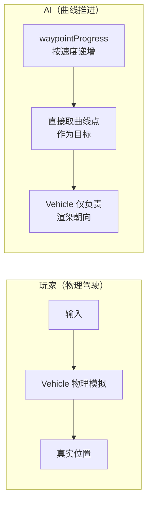
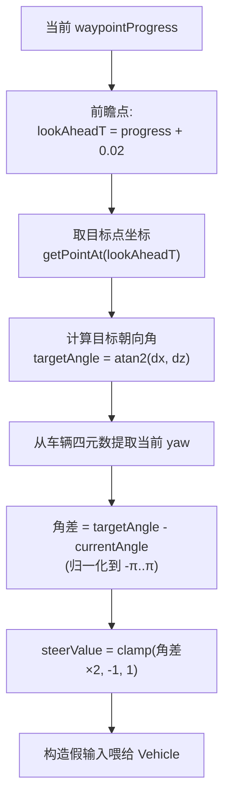
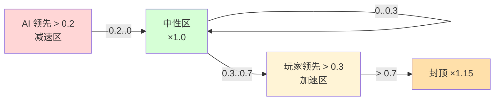

# 03 — AI 对手

> 本篇记录 AI 车辆的驾驶行为与橡皮筋（Rubber Band）难度调节机制。
>
> 涉及文件：`src/ai/AIDriver.ts`、`src/ai/RubberBanding.ts`

## 1. AI 设计取舍

街机赛车的 AI 设计面临一个经典矛盾：

- **拟真方案**：让 AI 走和玩家一样的物理驾驶（寻路 + 避障 + 物理碰撞）。代价是需要完整的路径规划、碰撞规避、恢复逻辑，工程复杂，且 AI 容易卡墙、互相碰撞。
- **简化方案**：让 AI 沿赛道曲线**直接推进位置**，复用物理车辆只为「看起来在开」。

**本项目选择简化方案**，这是街机赛车（如《马力欧卡丁车》早期作品）的常见做法：



**核心区别**：AI 的**位置进度**由参数 `waypointProgress ∈ [0,1)` 直接递增控制，物理车辆（`AIDriver.vehicle`）主要用于：
1. 提供统一的 `getPosition()` / `getQuaternion()` 接口给渲染和排名系统；
2. 让 AI 车看起来在转向、加速（通过构造「假输入」驱动 `Vehicle.updateFromInput`）。

> 注意：AI 车辆**确实有物理体**（会和其他物体碰撞），但其「前进」不完全依赖物理引擎——`waypointProgress` 才是权威进度源。

## 2. 赛道曲线参数化

AI 的世界模型是赛道曲线上的一个标量 `trackT ∈ [0,1)`：

- `t = 0`：起跑线
- `t = 0.5`：赛道中点
- `t = 1`：回到起跑（闭合曲线，`% 1` 循环）

曲线本身是 `THREE.CatmullRomCurve3`（详见 [04 赛道系统 §2](./04-track-system.md)），提供：
- `getPointAt(t)` → 曲线上的世界坐标点
- `getTangentAt(t)` → 该点的切线方向（单位向量）

AI 用 `t` 表示「我跑到赛道哪里了」，玩家进度也通过 `getPlayerApproxProgress()`（见 [06 §3](./06-game-flow.md)）转成同样的 `t`，二者可比较——这是橡皮筋机制的基础。

## 3. 转向控制算法

AI 的转向目标：**让车头朝向前方一个「前瞻点」**。

### 3.1 算法流程



### 3.2 关键实现细节

**① 前瞻（look-ahead）0.02**：AI 不看「当前点」（否则会原地打转），而是看前方 2% 进度处的点。这让转向更平滑、有「预见性」。前瞻太小→转向迟钝；太大→切弯激进。

**② 角度归一化（关键防错）：**

```ts
let angleDiff = targetAngle - currentAngle;
while (angleDiff > Math.PI) angleDiff -= 2 * Math.PI;
while (angleDiff < -Math.PI) angleDiff += 2 * Math.PI;
```

`atan2` 返回 `[-π, π]`。若 target = 3.1，current = -3.1，朴素差值 = 6.2，AI 会以为「要转 354°」而乱打方向。归一化到 `[-π, π]` 后差值 = -0.08（只需小幅左转）。**这是角度运算的必做步骤。**

**③ 从四元数提取 yaw：**

```ts
const plusZYaw = Math.atan2(
  2 * (q.w * q.y + q.x * q.z),
  1 - 2 * (q.y * q.y + q.z * q.z)
);
const currentAngle = plusZYaw + Math.PI;  // +Z 角 + π = -Z(前向)的 yaw
```

提取的是底盘 **+Z 轴的偏航角**，再加 π 转成 **-Z（前向）的偏航角**——与 [02 §4 的 -Z 约定](./02-physics.md) 一致。

**④ 角差线性映射到转向：**

```ts
const steerValue = Math.max(-1, Math.min(1, angleDiff * 2));
```

角差（弧度）× 2 后 clamp 到 `[-1, 1]`。系数 2 意味着约 28°（0.5 rad）的偏差就达到满打方向。这是一种简化的比例控制（P 控制），没有积分/微分项，但配合前瞻点已足够平滑。

## 4. 速度自适应（转弯减速）

直线全速、弯道减速——这是 AI 不「飞出弯道」的关键：

```ts
const curvature = Math.abs(angleDiff);        // 角差绝对值近似曲率
const turnBrake = curvature > 0.5 ? 0.6 : 1.0; // 急弯减到 60% 油门
const fakeInput = {
  forward: true,
  left: steerValue < -0.1,
  right: steerValue > 0.1,
  handbrake: curvature > 1.0,                  // 极急弯拉手刹
  steerX: steerValue,
  accel: turnBrake,
  // ...
};
```

| `|angleDiff|`（rad） | `|angleDiff|`（度） | 油门 | 手刹 | 含义 |
|---------------------|---------------------|------|------|------|
| < 0.5 | < 28° | 100% | 否 | 直道/缓弯，全速 |
| 0.5 ~ 1.0 | 28°~57° | 60% | 否 | 急弯，收油 |
| > 1.0 | > 57° | 60% | 是 | 发夹弯，甩尾过弯 |

注意：`turnBrake` 是赋给 `fakeInput.accel`（模拟油门量），但因为 AI 实际前进靠 `waypointProgress` 递增（见 §5），这个油门量主要影响**车辆姿态表现**（转速、声效），而非真实速度。真实速度由橡皮筋决定。

## 5. 橡皮筋（Rubber Band）机制 ⭐

这是街机赛车「让比赛永远胶着」的核心技巧，也是本项目 AI 的灵魂。

### 5.1 设计动机

真实赛车里，技术差距会让领先者越拉越远，落后者毫无希望——这**不好玩**。橡皮筋机制动态调整 AI 速度：

- **玩家领先**→ AI **加速**追上来（橡皮筋被拉伸，回弹）；
- **玩家落后**→ AI **减速**等一等（橡皮筋松弛）。

效果是比赛始终紧张，无论玩家水平如何。代价是「不真实」，但街机游戏优先趣味。

### 5.2 分段线性公式详解

`RubberBanding.update(playerProgress, aiProgress)` 每帧由 `AIDriver` 调用：

```ts
const diff = playerProgress - aiProgress;  // 正：玩家领先；负：AI领先
if (diff > 0.3) {
  // 玩家大幅领先 → AI 加速
  const t = Math.min((diff - 0.3) / 0.4, 1);
  this.currentMultiplier = 1 + behindBoostMin + t * (behindBoostMax - behindBoostMin);
} else if (diff < -0.2) {
  // AI 大幅领先 → AI 减速
  const t = Math.min((-diff - 0.2) / 0.4, 1);
  this.currentMultiplier = 1 - aheadReductionMin - t * (aheadReductionMax - aheadReductionMin);
} else {
  // 势均力敌 → 不调节
  this.currentMultiplier = 1.0;
}
```

**三个区间（以 normal 难度为例）：**



| 区间 | `diff`（player−ai） | 归一化 t | 倍率（normal） | 含义 |
|------|---------------------|----------|---------------|------|
| AI 领先 | `[-0.6, -0.2]` | `(−diff−0.2)/0.4` | `1 − 0.05 ~ 0.10` → **0.95 ~ 0.90** | AI 减速 5%~10% |
| 中性 | `[-0.2, 0.3]` | — | **1.0** | 不调节 |
| 玩家领先 | `[0.3, 0.7]` | `(diff−0.3)/0.4` | `1 + 0.10 ~ 0.15` → **1.10 ~ 1.15** | AI 加速 10%~15% |
| 封顶 | `> 0.7` | `t=1` | **1.15** | 防止 AI 过快失真 |

**关键设计点：**
- **死区（中性区）`[-0.2, 0.3]`**：差距不大时完全不调节，避免 AI 速度抖动。死区对玩家领先更宽容（0.3）对 AI 领先更敏感（0.2）——轻微偏向「让 AI 不要甩开玩家」。
- **线性插值 + 封顶**：调节幅度随差距线性增长但有上限，防止极端情况下 AI 倍速飙车或原地爬行。
- **`diff` 单位是 progress（0~1 的赛道比例）**，不是时间或距离。0.3 ≈ 30% 圈长。

### 5.3 三档难度配置

```ts
const DIFFICULTY_CONFIGS: Record<Difficulty, RubberBandConfig> = {
  easy:   { behindBoostMin: 0,    behindBoostMax: 0,    aheadReductionMin: 0,    aheadReductionMax: 0,    enabled: false },
  normal: { behindBoostMin: 0.10, behindBoostMax: 0.15, aheadReductionMin: 0.05, aheadReductionMax: 0.10, enabled: true  },
  hard:   { behindBoostMin: 0.15, behindBoostMax: 0.20, aheadReductionMin: 0.08, aheadReductionMax: 0.15, enabled: true  },
};
```

| 难度 | 橡皮筋 | AI 追赶倍率 | AI 等待减速 | 基础速度系数 | 体验 |
|------|--------|------------|------------|-------------|------|
| easy | **关闭** | ×1.0 | ×1.0 | ×0.8 | AI 慢且不追赶，轻松 |
| normal | 开 | +10%~15% | −5%~10% | ×1.0 | 标准胶着 |
| hard | 开 | +15%~20% | −8%~15% | ×1.1 | AI 又快又紧咬 |

**两个独立的难度维度：**
1. **`enabled`**：easy 关闭橡皮筋（纯靠基础速度让玩家）。
2. **基础速度系数 `speedFactor`**（在 AIDriver 构造时设定）：easy=0.8、normal=1.0、hard=1.1。这是「天生快慢」，与橡皮筋的「动态调节」相乘。

### 5.4 倍率的合成

最终 AI 的推进速度由三个因子相乘：

```ts
// AIDriver.update()
this.rubberBanding.update(playerProgress, this.waypointProgress);
const speedMult = this.rubberBanding.getSpeedMultiplier() * this.speedFactor;
const baseSpeed = 0.08;                          // 基础推进速率（progress/秒）
const advanceSpeed = baseSpeed * speedMult * dt;
this.waypointProgress = (this.waypointProgress + advanceSpeed) % 1;
```

`baseSpeed = 0.08` 表示 normal 难度下 AI 每秒推进 8% 圈长（约 12.5 秒一圈的理论值，实际受弯道减速影响）。

## 6. AI 与玩家的统一接口

AI 车辆复用玩家的 `Vehicle` 类，通过构造「假输入」驱动：

```ts
const fakeInput = {
  forward: true, backward: false,
  left: steerValue < -0.1, right: steerValue > 0.1,
  handbrake: curvature > 1.0,
  useItem: false, pause: false, resetVehicle: false,
  steerX: steerValue, accel: turnBrake, brake: 0,
};
this.vehicle.updateFromInput(fakeInput, dt);
```

好处：AI 和玩家走**同一套物理代码**，手感一致；AI 车辆同样会漂移、有引擎声效、被道具影响。区别只在于「输入从哪来」——玩家来自 InputManager，AI 来自算法。

> AI 当前**不使用道具**（`useItem: false`），也没有道具拾取逻辑——这是已知的功能边界。

## 7. 起跑位置错峰

5 名 AI 不堆在起跑线，而是**沿赛道往后错开**：

```ts
const startT = ((1 - (i + 1) * 0.03) + 1) % 1;  // i=0..4 → t≈0.97,0.94,0.91,0.88,0.85
```

- `t` 从 0.97 开始，每往后 0.03（即 3% 圈长），共 5 辆。
- 由于曲线闭合，`t=0.97` 实际在起跑线（t=0）**稍后方**。
- `% 1` 防止负值越界。

这让发车时 AI 呈梯队排列，避免首弯全部挤在一起。

## 8. 小结

| 机制 | 实现要点 |
|------|---------|
| AI 运动模型 | 沿曲线 progress 推进，复用物理车辆仅为姿态 |
| 转向控制 | 前瞻点 + 角差归一化 + 线性 P 控制 |
| 转弯减速 | 按角差绝对值分档收油/手刹 |
| 橡皮筋 | 分段线性，玩家领先加速、AI 领先减速，带死区与封顶 |
| 难度 | 基础速度系数（0.8/1.0/1.1）× 橡皮筋倍率，easy 关闭橡皮筋 |
| 统一接口 | 假输入复用 Vehicle，AI 与玩家手感一致 |

AI 依赖的赛道曲线见 [04 赛道系统](./04-track-system.md)；玩家进度的计算见 [06 游戏流程 §3](./06-game-flow.md)。
