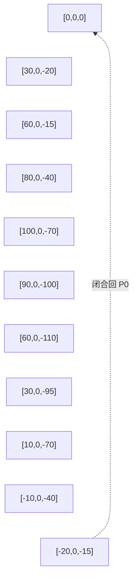
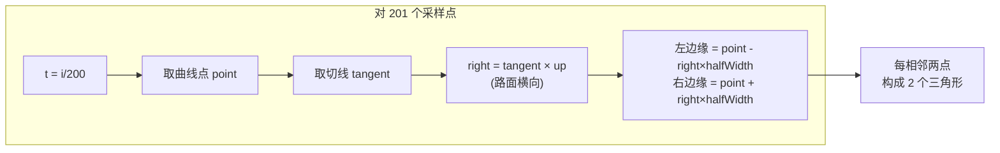
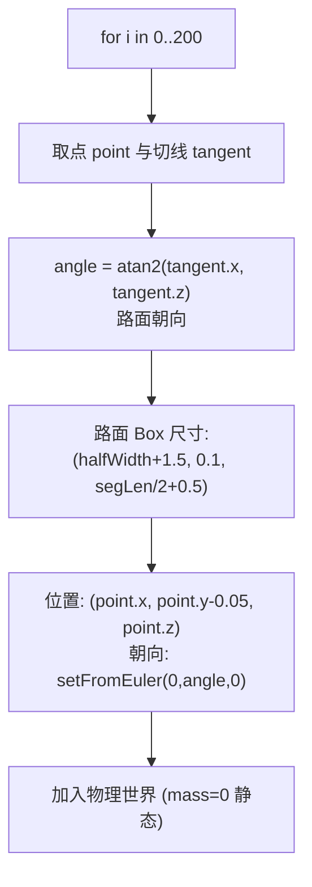
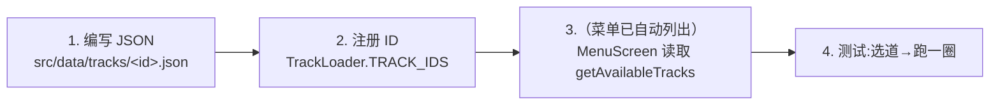

# 04 — 赛道系统

> 本篇记录赛道的数据定义、曲线生成、网格构建与物理碰撞体铺设。
>
> 涉及文件：`src/rendering/TrackMesh.ts`、`src/physics/TrackCollider.ts`、`src/data/TrackLoader.ts`、`src/data/tracks/*.json`

## 1. 数据驱动设计

赛道完全由 JSON 配置驱动，新增赛道无需改代码。`TrackLoader` 通过 Vite 的**动态 import** 按需加载：

```ts
async load(trackId: string): Promise<TrackData> {
  const cached = this.cache.get(trackId);
  if (cached) return cached;
  const data = await import(`./tracks/${trackId}.json`);  // 动态加载
  this.cache.set(trackId, data.default as TrackData);
  return data.default as TrackData;
}
```

- **动态 import**：Vite 会把每个 JSON 拆成独立 chunk，首屏只加载菜单，选赛道时才按需拉取，减小初始包体。
- **Map 缓存**：同一赛道重赛不重复请求。

### TrackData 结构（`src/rendering/TrackMesh.ts`）

```ts
interface TrackData {
  name: string;            // 显示名（如 "城市街道"）
  id: string;              // 唯一标识（如 "city"）
  difficulty: string;      // 显示用难度标签
  totalLaps: number;       // 圈数
  roadWidth: number;       // 路面宽度 (m)
  splinePoints: number[][]; // 样条控制点 [[x,y,z], ...]
  startPosition: number[];
  startRotation: number[];
  checkpoints: number[];    // 检查点的 t 值
  itemBoxPositions: number[]; // 道具箱的 t 值
  environment: {            // 视觉环境
    groundColor: number; roadColor: number;
    skyTopColor: number; skyBottomColor: number;
    decorations: string;
  };
}
```

> 注意：`startPosition` / `startRotation` 字段在 JSON 中存在，但**当前代码未直接使用**——起跑位置实际由 `trackMesh.getPointAt(0)`（曲线起点）推导。`totalLaps` 字段当前同样**未生效**：`LapTracker` 构造函数接收了该参数但没有使用，圈数硬编码为 3（见 [06 §2.1](./06-game-flow.md)）。这些是数据与实现的轻微冗余。

## 2. 赛道曲线

赛道骨架是一条**闭合的 Catmull-Rom 样条曲线**：

```ts
this.curve = new THREE.CatmullRomCurve3(points, true, 'catmullrom', 0.5);
//                                              ↑闭合  ↑类型      ↑tension
```

### Catmull-Rom 样条特性

| 特性 | 说明 |
|------|------|
| **过控制点** | 曲线必定穿过每个 `splinePoint`（不同于 Bézier 的「吸引」） |
| **局部性** | 移动一个控制点只影响邻近段，便于编辑 |
| **闭合** | 第二参数 `true`，首尾自动连接成环，无接缝 |
| **tension 0.5** | centripetal 参数，控制曲线「松紧」。0.5 是 Catmull-Rom 经典值，曲线光滑且不易自交 |

以 `city.json` 为例，11 个控制点构成一个近似椭圆形的城市赛道：



曲线提供两个核心查询方法，贯穿整个系统：
- `getPointAt(t)` → 曲线点坐标（路面、碰撞体、checkpoint、道具箱、AI、相机都用它）
- `getTangentAt(t)` → 切线方向（用于计算路面朝向、护栏法向、车辆起跑朝向）

> **精度提示**：`TrackMesh.getPointAt` 内部调用的是 `curve.getPoint`（**参数化 t**），并非 Three.js 曲线原生的 `getPointAt`（弧长均匀化版本）。控制点分布不均匀时，`t=0.5` 不严格等于弧长中点，「t 的比例 ≈ 圈长比例」只是近似——橡皮筋死区宽度（[03 §5](./03-ai-opponents.md)）与 checkpoint 间距都建立在这个近似上。

## 3. 路面网格生成算法

路面用**程序化网格**生成，而非美术建模——这样任意控制点都能自动铺出路面。

### 3.1 算法：沿曲线铺「三角带」



核心实现（`TrackMesh.buildRoad`）：

```ts
const numSamples = 200;
for (let i = 0; i <= numSamples; i++) {
  const point = this.curve.getPoint(i / numSamples);
  const tangent = this.curve.getTangent(i / numSamples);
  right.crossVectors(tangent, up).normalize();           // 横向向量
  const leftPt  = point.clone().add(right.clone().multiplyScalar(-halfWidth));
  const rightPt = point.clone().add(right.clone().multiplyScalar(halfWidth));
  positions.push(leftPt.x, leftPt.y, leftPt.z);
  positions.push(rightPt.x, rightPt.y, rightPt.z);
}
// 三角形索引：相邻两个「左右边」构成一个四边形 → 2 个三角形
for (let i = 0; i < numSamples; i++) {
  const base = i * 2, next = (i + 1) * 2;
  indices.push(base, next, base + 1);
  indices.push(base + 1, next, next + 1);
}
geometry.computeVertexNormals();  // 自动算法线供光照
```

**要点：**
- **200 段 × 2 边 = 402 顶点**，构成连续三角带。采样越多越平滑（尤其弯道），但顶点更多。
- **`right = tangent × up`**：切线与世界上方向叉乘，得到路面「左右方向」。叉乘保证 right 始终垂直于行进方向。
- `halfWidth` 来自 `roadWidth/2`（city 为 6m，整条路 12m 宽）。
- 使用 `MeshLambertMaterial`（Low-poly 风格，无高光）。

## 4. 护栏生成

护栏用 **TubeGeometry 包裹偏移曲线**实现，比逐段 Box 更圆滑：

```ts
private buildBarriers(): void {
  const halfWidth = this.trackData.roadWidth / 2 + 0.5;  // 比路面宽 0.5m
  // 沿曲线生成左右两条偏移点序列
  for (let i = 0; i <= numSamples; i++) {
    const point = this.curve.getPoint(i / numSamples);
    const right = ...; // 同路面算法
    leftPoints.push(point.clone().add(right.clone().multiplyScalar(-halfWidth)));
    rightPoints.push(point.clone().add(right.clone().multiplyScalar(halfWidth)));
  }
  // 偏移点 → 新的闭合曲线 → 管状网格
  const leftCurve = new THREE.CatmullRomCurve3(leftPoints, true, 'catmullrom', 0.5);
  const leftTubeGeo = new THREE.TubeGeometry(leftCurve, numSamples, 0.3, 8, true);
  // 0.3 = 管半径，8 = 截面分段
}
```

- 护栏是**半径 0.3m 的管子**，沿路面边缘延伸，材质为纯红色（`0xff0000` 的 `MeshLambertMaterial`）。
- 偏移 0.5m 留出路肩空间，防止车轮贴边时穿模。

## 5. 物理碰撞体（⭐ 重点）

**这是赛道系统最复杂的部分**：要让车辆「在路面上跑、撞到护栏会停」，需要沿曲线铺设大量静态碰撞体。

### 5.1 三类碰撞体

`TrackCollider.build()` 创建：

| 碰撞体 | 形状 | 数量 | 作用 |
|--------|------|------|------|
| 地面 | `Plane`（无限大） | 1 | 兜底，防止车辆永远下落 |
| 路面段 | `Box` | ~201 | 车辆行驶的地面 |
| 左/右护栏 | `Box` | ~201×2 | 阻止车辆冲出赛道 |

### 5.2 路面段铺设算法

沿曲线每隔一段铺一个 Box，每个 Box 对齐该处切线方向：



```ts
for (let i = 0; i < points.length; i++) {
  const point = points[i];
  const nextPoint = points[(i + 1) % points.length];
  const dist = point.distanceTo(nextPoint);
  const tangent = trackMesh.curve.getTangent(i / points.length);
  const angle = Math.atan2(tangent.x, tangent.z);  // 切线朝向

  const roadBody = new CANNON.Body({
    mass: 0,  // 静态，不受力
    shape: new CANNON.Box(new CANNON.Vec3(roadHalfWidth + 1.5, 0.1, dist / 2 + 0.5)),
    position: new CANNON.Vec3(point.x, point.y - 0.05, point.z),
    quaternion: new CANNON.Quaternion().setFromEuler(0, angle, 0),
  });
  world.addBody(roadBody);
}
```

**尺寸设计：**
- **宽 `roadHalfWidth + 1.5`**：比可视路面宽 1.5m，留出路肩，防止车轮边缘悬空。
- **高 0.1**：薄板，充当地面。RaycastVehicle 的射线命中它即视为「在地面」。
- **长 `dist/2 + 0.5`**：半值，+0.5m 让相邻段**重叠**，消除接缝（否则车辆压缝会颠簸）。

> **历史教训**：提交 `bf896bc 修复车辆弹跳的问题` 很可能与路面段接缝/重叠有关——重叠不足会让射线在段间「落空」产生弹跳。

### 5.3 护栏铺设与法向计算

护栏沿路面**横向偏移**放置，关键在于求「垂直于切线的法向」：

```ts
// 切线 tangent = (tx, _, tz)（XZ 平面）
const rx = -tangent.z;  // 法向分量（旋转 90°）
const rz = tangent.x;
const rLen = Math.sqrt(rx * rx + rz * rz);
const rnx = rLen > 0.001 ? rx / rLen : 0;  // 归一化
const rnz = rLen > 0.001 ? rz / rLen : 1;

// 左护栏：沿 -法向 偏移
const leftWall = new CANNON.Body({
  shape: new CANNON.Box(new CANNON.Vec3(0.3, 1.0, dist / 2 + 0.5)),
  position: new CANNON.Vec3(
    point.x + rnx * (-barrierOffset),  // barrierOffset = halfWidth + 0.5
    point.y + 1.0,
    point.z + rnz * (-barrierOffset),
  ),
  // ...右护栏同理，偏移 +barrierOffset
});
```

**法向计算的数学原理：** 切线 `(tx, tz)` 在 XZ 平面逆时针旋转 90° 得 `(-tz, tx)`。这给出「右手边」方向。左护栏取负、右护栏取正。

护栏尺寸 `Box(0.3, 1.0, dist/2+0.5)`：厚 0.3m、高 1m（防止车辆翻越）、与路面段同长。

### 5.4 地面兜底平面

```ts
const groundBody = new CANNON.Body({
  mass: 0,
  shape: new CANNON.Plane(),
  position: new CANNON.Vec3(0, -0.3, 0),
});
groundBody.quaternion.setFromEuler(-Math.PI / 2, 0, 0);  // 水平
```

一个无限大水平面，位于 y=-0.3。作用是**保险**：即使车辆因 bug 穿出赛道（如路面段接缝漏洞），也不会无限下落，而是停在这个平面上，触发 OOB 检测回正（见 [06 §4](./06-game-flow.md)）。

## 6. Checkpoint 系统

Checkpoint 用**曲线 t 值**定义，而非世界坐标：

```json
"checkpoints": [0, 0.25, 0.5, 0.75, 1.0]
```

`LapTracker` 构造时把每个 t 值转成世界坐标点（`getPointAt(t)`），作为「触发球」中心。车辆进入半径 8m 内即视为通过该 checkpoint（详见 [06 §2](./06-game-flow.md)）。

- **顺序通过**：必须依次经过 0→0.25→0.5→0.75→回到 0（=1.0，闭合），才算一圈。防止抄近路。
- **t 值定义的好处**：与曲线绑定，改控制点后 checkpoint 自动跟随，无需手动调坐标。

## 7. 道具箱放置

道具箱同样用 t 值定位：

```json
"itemBoxPositions": [0.1, 0.3, 0.5, 0.7, 0.9]
```

`ItemManager` 把每个 t 值转成世界坐标，放置发光金箱（详见 [05 道具系统 §4](./05-items-system.md)）。

## 8. 新赛道接入清单

新增一条赛道的完整步骤：



**第 1 步：编写 JSON**（参考 `city.json`）
- 关键是 `splinePoints`：控制点要构成**闭合且不自交**的形状。建议 8~15 个点。
- `checkpoints` 与 `itemBoxPositions` 的 t 值要均匀分布。
- `roadWidth` 建议 10~14（太窄 AI 易撞墙，太宽无挑战）。

**第 2 步：注册 ID**

```ts
// src/data/TrackLoader.ts
const TRACK_IDS = ['city', 'coast', 'desert', 'mytrack']; // ← 添加
```

> **注意**：JSON 文件名必须等于 id。动态 import 用 `./tracks/${trackId}.json` 定位文件。

**基本无需改其他代码**——路面、护栏、碰撞体、checkpoint 全部由数据驱动自动生成。唯一例外是 `totalLaps`：JSON 中的值被 `LapTracker` 忽略（硬编码 3 圈，见 [06 §2.1](./06-game-flow.md)），改圈数需改代码。

## 9. 小结

| 组件 | 生成方式 | 数量级 |
|------|---------|--------|
| 曲线 | CatmullRom 闭合样条（控制点来自 JSON） | 1 条 |
| 路面网格 | 沿曲线铺三角带（200 段） | 402 顶点 |
| 护栏 | 偏移曲线 + TubeGeometry | 2 条管 |
| 路面碰撞体 | 沿曲线排 Box（对齐切线，相邻重叠） | ~201 |
| 护栏碰撞体 | 沿曲线排 Box（法向偏移） | ~402 |
| 地面 | 单个无限平面（兜底） | 1 |
| Checkpoint | t 值锚点 → 8m 触发球 | 5 |

车辆如何在这套碰撞体上行驶见 [02 物理模型](./02-physics.md)；AI 如何沿曲线推进见 [03 AI 对手](./03-ai-opponents.md)。
