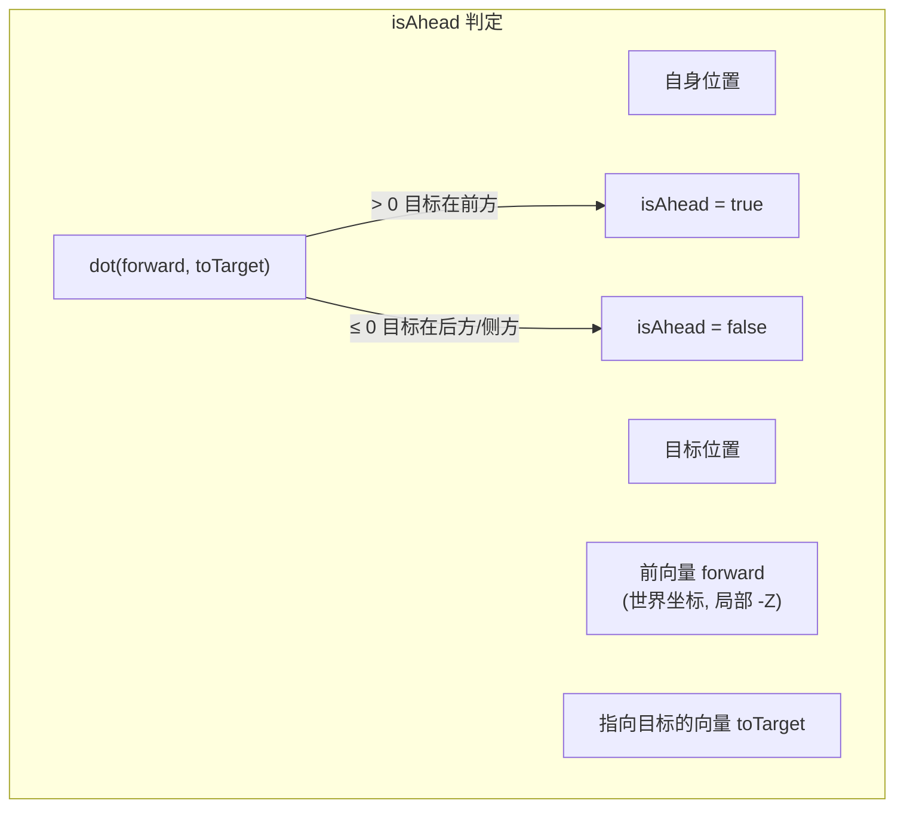
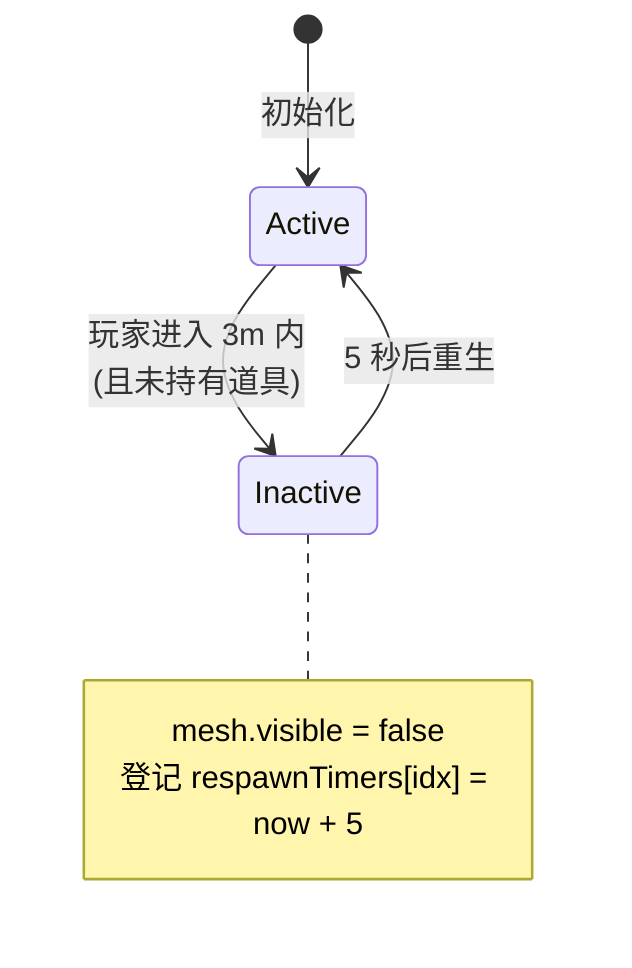

# 05 — 道具系统

> 本篇记录道具的抽取、效果实现与道具箱的生命周期管理。
>
> 涉及文件：`src/items/ItemEffects.ts`、`src/items/ItemManager.ts`

## 1. 道具总览

游戏有 4 种道具，玩家拾取后可主动使用（Shift / 手柄 A）。

| 道具 | 枚举 | 效果 | 目标 | 持续 |
|------|------|------|------|------|
| 加速 | `BOOST` | 自身最高速与引擎力 ×1.5 | 自身 | 3 秒 |
| 炸弹 | `BOMB` | 前方最近敌车减速到 50% | 前方最近 1 辆 | 2 秒 |
| 护盾 | `SHIELD` | （占位，当前无实际效果） | 自身 | — |
| 闪电 | `LIGHTNING` | 前方随机敌车原地旋转 | 前方随机 1 辆 | 1.5 秒 |

> **现状说明**：`SHIELD` 目前只返回提示文案 `"SHIELD ON!"`，未实现实际防护逻辑（不抵挡 BOMB/LIGHTNING）。这是已知的功能占位。

道具的核心是两个文件：`ItemEffects.ts`（纯函数，定义道具表与效果）和 `ItemManager.ts`（管理道具箱实体的拾取与重生）。

## 2. 加权随机抽取算法

拾取道具箱时，获得的道具类型由**加权随机**决定。

### 2.1 道具权重表

```ts
const ITEM_TABLE: ItemDrop[] = [
  { type: ItemType.BOOST,     weight: 40 },
  { type: ItemType.BOMB,      weight: 30 },
  { type: ItemType.SHIELD,    weight: 20 },
  { type: ItemType.LIGHTNING, weight: 10 },
];
```

| 道具 | 权重 | 概率 | 设计意图 |
|------|------|------|---------|
| BOOST | 40 | **40%** | 最常见，鼓励进攻性驾驶 |
| BOMB | 30 | **30%** | 常见攻击手段 |
| SHIELD | 20 | **20%** | 防御向，较少 |
| LIGHTNING | 10 | **10%** | 最稀有，效果最强（旋转失控） |

权重设计遵循「**效果越强，概率越低**」的街机平衡原则：加速无害故最常见，闪电能直接打乱对手节奏故最稀有。

### 2.2 累减权重法（roulette wheel）

```ts
export function rollItem(): ItemType {
  const totalWeight = ITEM_TABLE.reduce((sum, item) => sum + item.weight, 0);  // 100
  let roll = Math.random() * totalWeight;   // [0, 100)
  for (const item of ITEM_TABLE) {
    roll -= item.weight;
    if (roll <= 0) return item.type;        // 命中
  }
  return ItemType.BOOST;                     // 兜底（浮点边界）
}
```

**算法原理（轮盘赌）：** 把 `[0, totalWeight)` 区间按权重切成连续段，随机数落在哪段就返回对应道具。

```mermaid
graph LR
    A["roll ∈ [0,100)"] --> B["roll -= 40"]
    B --> C{"roll ≤ 0?"}
    C -- 是 → D["返回 BOOST<br/>(落在 0~40)"]
    C -- 否 --> E["roll -= 30"]
    E --> F{"roll ≤ 0?"}
    F -- 是 → G["返回 BOMB<br/>(落在 40~70)"]
    F -- 否 --> H["roll -= 20"]
    H --> I{"roll ≤ 0?"}
    I -- 是 → J["返回 SHIELD<br/>(落在 70~90)"]
    I -- 否 --> K["返回 LIGHTNING<br/>(落在 90~100)"]
```

- 总权重 100 → 概率直观（权重即百分比）。
- 兜底 `return BOOST`：理论上不会触达（roll 最终必 ≤0），仅防浮点误差。
- **扩展友好**：新增道具只需往 `ITEM_TABLE` 加一项，无需改 `rollItem`。

## 3. 道具效果实现

`applyItemEffect(itemType, self, targets)` 是纯函数，根据道具类型分支处理，返回 `{ message, affectedTargets }`。

### 3.1 BOOST（自身加速）

```ts
case ItemType.BOOST:
  self.applyBoost(3);
  return { message: 'BOOST!', affectedTargets: [] };
```

调用 `Vehicle.applyBoost(3)`，设置 3 秒后的结束时间戳。加速期间最高速 ×1.5、引擎力 ×1.5（见 [02 §6.1](./02-physics.md)）。无目标，仅影响自身。

### 3.2 BOMB（前方最近敌车减速）

```ts
case ItemType.BOMB: {
  const target = findTargetAhead(self, targets);  // 找前方最近敌车
  if (target) {
    target.applySpeedReduction(0.5, 2);  // 速度降到 50%，持续 2 秒
    return { message: 'BOMB HIT!', affectedTargets: [target] };
  }
  return { message: 'BOMB MISS!', affectedTargets: [] };  // 前方无人
}
```

- **目标选择**：`findTargetAhead` 在所有「位于自身前方」的敌车中选**距离最近**的一个。
- **命中判定**：见 §3.4 的 `isAhead`。
- **未命中处理**：前方无车时返回 MISS，道具「浪费」——鼓励在合适时机使用。

### 3.3 LIGHTNING（前方随机敌车旋转）

```ts
case ItemType.LIGHTNING: {
  const ahead = targets.filter(t => isAhead(self, t));  // 所有前方敌车
  if (ahead.length > 0) {
    const target = ahead[Math.floor(Math.random() * ahead.length)]; // 随机选一
    applySpinEffect(target, 1.5);  // 原地旋转 1.5 秒
    return { message: 'LIGHTNING!', affectedTargets: [target] };
  }
  return { message: 'LIGHTNING MISS!', affectedTargets: [] };
}
```

- 与 BOMB 的区别：**随机**选前方任一辆（不一定是最近的），效果更强（旋转失控 vs 仅减速）。
- **旋转实现**：

```ts
function applySpinEffect(vehicle: Vehicle, duration: number): void {
  const body = vehicle.chassisBody;
  body.angularVelocity.set(0, 5, 0);   // Y 轴角速度 5 rad/s
  setTimeout(() => {
    body.angularVelocity.set(0, 0, 0);  // 1.5 秒后停止
  }, duration * 1000);
}
```

直接给底盘施加 Y 轴角速度，车辆原地打转 1.5 秒——这段时间内玩家几乎无法控车，是最具破坏力的道具。

### 3.4 命中判定核心：isAhead

所有攻击道具都依赖「判断目标是否在自己前方」：

```ts
function isAhead(self: Vehicle, target: Vehicle): boolean {
  const selfPos = self.getPosition();
  const targetPos = target.getPosition();
  const forward = new CANNON.Vec3(0, 0, -1);  // 前向 = 局部 -Z（见 02 §4）
  self.chassisBody.quaternion.vmult(forward, forward);  // 旋到世界坐标
  const toTarget = new CANNON.Vec3(targetPos.x - selfPos.x, 0, targetPos.z - selfPos.z);
  return forward.dot(toTarget) > 0;
}
```

**几何含义：**



点积 > 0 表示两向量夹角 < 90°，即目标在自身「前半球」内。

> **前向向量必须用 `-Z`**：本项目约定车辆前向是**局部 -Z**（见 [02 §4](./02-physics.md)，与 `getSpeed()` 的 `(0,0,-1)` 一致）。此处 `forward` 与 `toTarget` 做点积，两者必须用同一前向约定，否则「前方」与「后方」会整个翻转——曾经的 bug 正是这里误用了 `+Z`，导致 BOMB/LIGHTNING 实际打击的是**身后**的车辆。现已修正为 `(0,0,-1)`。

### 3.5 效果对车辆的影响对比

| 道具 | 调用 | 改变的车辆属性 | 恢复机制 |
|------|------|--------------|---------|
| BOOST | `applyBoost(3)` | `boostEndTime`（间接提升 maxSpeed+engineForce） | 时间戳到期自动 |
| BOMB | `applySpeedReduction(0.5,2)` | `currentMaxSpeed = maxSpeed×0.5` | setTimeout 2 秒后恢复 |
| LIGHTNING | 直接设 `angularVelocity` | `chassisBody.angularVelocity` | setTimeout 1.5 秒后清零 |
| SHIELD | 无 | 无 | — |

加速用「时间戳」，减速/旋转用「setTimeout」——区别在于：加速只需在每帧判断里查时间戳；减速和旋转需要一个「到期动作」把属性改回，setTimeout 更直接（见 [02 §6](./02-physics.md) 对比）。

## 4. 道具箱生命周期

`ItemManager` 管理赛道上的金色道具箱实体，玩家撞击后拾取，定时重生。

### 4.1 数据结构

```ts
private itemBoxes: { mesh: THREE.Mesh; tValue: number; active: boolean }[] = [];
private respawnTimers: Map<number, number> = new Map();  // 索引 → 重生时间
private readonly respawnDelay: number = 5;  // 5 秒重生
```

- 每个 box 记录：网格（视觉）、t 值（赛道位置）、是否激活。
- `respawnTimers` 用索引作 key，避免对象引用比较。

### 4.2 生命周期状态机



### 4.3 拾取逻辑（update 每帧）

```ts
update(currentTime, playerPos, heldItem): ItemType | null {
  // ① 处理到期重生
  for (const [idx, respawnTime] of this.respawnTimers) {
    if (currentTime >= respawnTime) {
      this.itemBoxes[idx].active = true;
      this.itemBoxes[idx].mesh.visible = true;
      this.respawnTimers.delete(idx);
    }
  }
  // ② 激活箱子的动画（旋转 + 浮动）
  for (const box of this.itemBoxes) {
    if (box.active) {
      box.mesh.rotation.y += 0.02;
      box.mesh.position.y = 1.5 + Math.sin(currentTime * 3) * 0.2;  // 上下浮动
    }
  }
  // ③ 拾取检测（仅当未持有道具时）
  let pickedUp: ItemType | null = null;
  if (heldItem === null) {
    for (let i = 0; i < this.itemBoxes.length; i++) {
      const box = this.itemBoxes[i];
      if (!box.active) continue;
      const dx = playerPos.x - box.mesh.position.x;
      const dz = playerPos.z - box.mesh.position.z;
      if (Math.sqrt(dx*dx + dz*dz) < 3) {           // 3m 内
        box.active = false;
        box.mesh.visible = false;
        this.respawnTimers.set(i, currentTime + 5);  // 5 秒后重生
        pickedUp = rollItem();                       // 随机出道具
        break;                                       // 一帧只拾取一个
      }
    }
  }
  return pickedUp;
}
```

**关键设计点：**

| 设计 | 实现 | 理由 |
|------|------|------|
| **一次只能持有一个道具** | `heldItem === null` 才检测拾取 | 防囤积，强制玩家用掉再捡 |
| **拾取距离 3m** | `dist < 3` | 比 checkpoint 的 8m 更严格，需较准撞击 |
| **2D 距离判定** | 仅用 x、z，忽略 y | 道具箱固定高度，无需立体检测 |
| **重生 5 秒** | `respawnDelay = 5` | 平衡：够长避免无限刷，够短不致断供 |
| **break 后返回** | 命中即退出循环 | 一帧只拾取一个 |

### 4.4 视觉动画

激活的箱子有两个动画：
- **自转**：`rotation.y += 0.02`（每帧约 1.1°），吸引注意。
- **浮动**：`y = 1.5 + sin(t×3)×0.2`，正弦上下浮动 ±0.2m，频率约 0.48Hz。

失活时 `visible = false` 直接隐藏（不删除网格，便于重生复用）。

## 5. 小结

| 机制 | 实现要点 |
|------|---------|
| 抽取 | 累减权重法，BOOST 40% 最常见，LIGHTNING 10% 最稀有 |
| 加速 | 时间戳机制，3 秒 |
| 攻击道具 | isAhead 点积判定「前方」(局部 -Z)，BOMB 选最近、LIGHTNING 选随机 |
| 旋转 | 直接设 angularVelocity，1.5 秒后清零 |
| 道具箱 | 单道具持有、3m 拾取、5 秒重生 |
| 攻击方向 | `isAhead` 用 `(0,0,-1)` 与全项目 -Z 约定一致（已修复，原为 `+Z` 导致打击方向反向） |

道具被使用的编排（HUD 提示、音效、对 AI 车辆应用）见 [06 游戏流程](./06-game-flow.md)。
