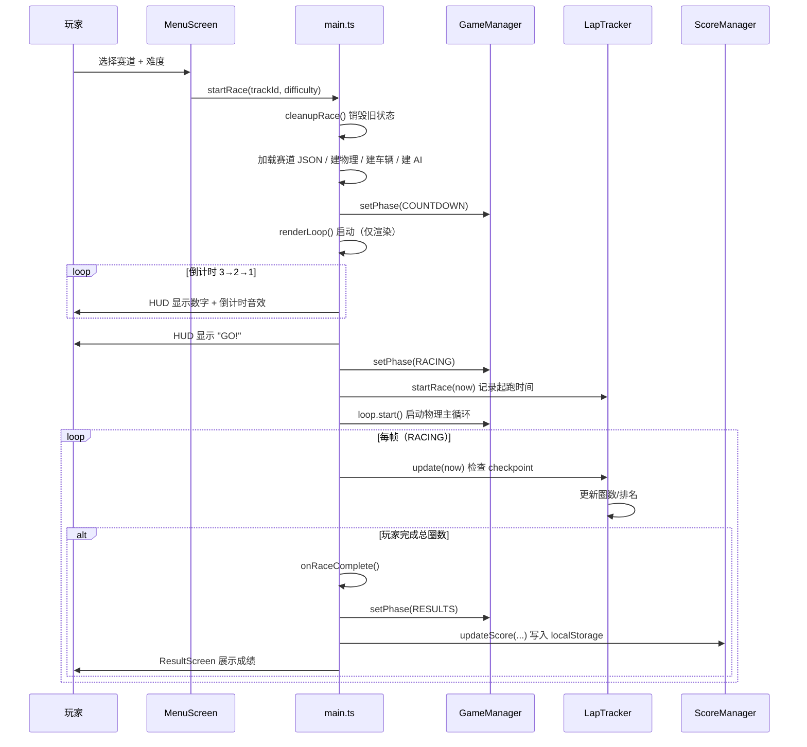
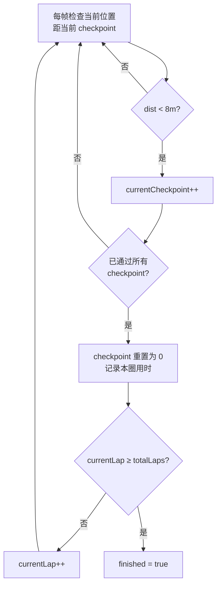
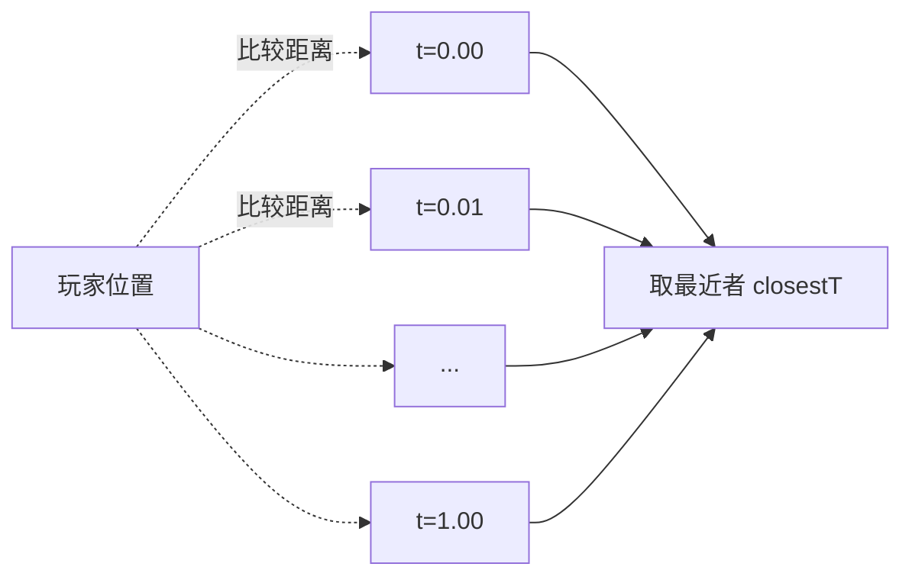
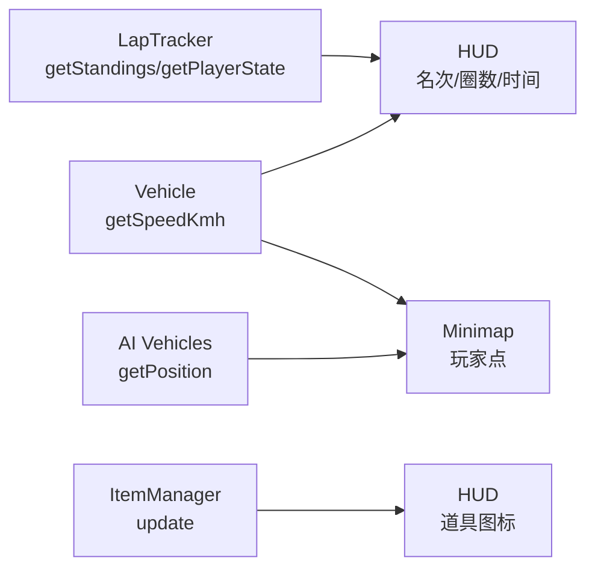

# 06 — 游戏流程与数据

> 本篇记录一局完整比赛的时序、圈数与排名算法、越界检测与成绩持久化。
>
> 涉及文件：`src/game/GameManager.ts`、`src/game/GameState.ts`、`src/game/LapTracker.ts`、`src/game/ScoreManager.ts`、`src/main.ts`

## 1. 完整对局时序

一局比赛从菜单到结算的全流程：



**关键编排点：**
- **倒计时期间物理冻结**：COUNTDOWN 阶段只渲染不步进物理，倒计时结束 `loop.start()` 才启动物理，保证公平起跑。
- **PAUSED 不在时序图中 ⚠️**：玩家按 ESC 时实际只执行 `setPhase(PAUSED)` + 显示遮罩 + 停引擎音，**并未调用 `loop.stop()`**——物理在暂停期间继续步进，圈速按绝对时间累计（暂停时长计入成绩）。恢复时重置 `lastRaceTime` 只防止渲染帧 dt 跳变，不影响比赛计时。详见 [01 §4](./01-architecture.md) 的已知问题说明。

## 2. 圈数与排名算法

`LapTracker` 是竞速逻辑的核心，追踪所有参赛者（玩家 + 若干 AI，数量由菜单选择）的进度。

### 2.1 RacerState（每名参赛者的状态）

```ts
interface RacerState {
  vehicle: Vehicle;
  currentCheckpoint: number;   // 下一个要触发的 checkpoint 索引
  currentLap: number;          // 当前圈
  totalLaps: number;           // 总圈数（当前硬编码 3，见下方注意）
  lapTimes: number[];          // 每圈用时
  lapStartTime: number;        // 本圈开始时间
  raceStartTime: number;       // 比赛开始时间
  finished: boolean;           // 是否完赛
  isPlayer: boolean;
}
```

> **⚠️ `totalLaps` 当前是硬编码**：`LapTracker` 构造函数虽然接收 `totalLaps` 参数（`main.ts` 传入 `trackData.totalLaps`），但从未使用；`addRacer` 中写死 `totalLaps: 3`。赛道 JSON 里的圈数设置**不生效**，改圈数必须改代码（见 [04 §8](./04-track-system.md)）。

### 2.2 Checkpoint 触发（update 每帧）

```ts
update(currentTime: number): void {
  for (const racer of this.racers) {
    if (racer.finished) continue;
    const pos = racer.vehicle.getPosition();
    const checkpoint = this.checkpoints[racer.currentCheckpoint];
    const dist = distance(pos, checkpoint.position);  // XZ 平面距离
    if (dist < this.triggerDistance) {  // triggerDistance = 8m
      racer.currentCheckpoint++;
      if (racer.currentCheckpoint >= this.checkpoints.length) {
        // 跑完所有 checkpoint → 完成一圈
        racer.currentCheckpoint = 0;
        racer.lapTimes.push(currentTime - racer.lapStartTime);
        racer.lapStartTime = currentTime;
        if (racer.currentLap >= racer.totalLaps) {
          racer.finished = true;          // 完赛
        } else {
          racer.currentLap++;
        }
      }
    }
  }
}
```

**圈数判定逻辑：**



**防作弊设计：**
- **必须顺序触发**：必须依次经过 cp[0]→cp[1]→...→cp[4]→cp[0]，抄近路跳过中间 checkpoint 不会计圈。
- **8m 触发半径**：足够宽松（高速下不会「漏掉」checkpoint），又不会误触发相邻 checkpoint（city 赛道 checkpoint 间距远大于 8m）。

> **⚠️ AI 的圈数追踪有局限**：AI 的位置由 `waypointProgress` 推进，但其 `vehicle.getPosition()` 返回的是物理底盘位置（可能与曲线点有偏差）。通常能正常触发 checkpoint，但极端情况（物理碰撞把 AI 推离曲线）可能漏检。这是简化 AI 方案的已知代价。

### 2.3 排名算法（getStandings）

排名用**多级排序**，每级决定一个维度：

```ts
getStandings(): RacerState[] {
  return [...this.racers].sort((a, b) => {
    if (a.finished && !b.finished) return -1;       // ① 完赛的排前
    if (!a.finished && b.finished) return 1;
    if (a.finished && b.finished)                    // ② 都完赛：比末圈用时（⚠️ 非总用时）
      return lastLapTime(a) - lastLapTime(b);
    if (a.currentLap !== b.currentLap)               // ③ 圈数多的排前
      return b.currentLap - a.currentLap;
    if (a.currentCheckpoint !== b.currentCheckpoint) // ④ checkpoint 多的排前
      return b.currentCheckpoint - a.currentCheckpoint;
    return distToNextCheckpoint(a) - distToNextCheckpoint(b); // ⑤ 离下一点近的排前
  });
}
```

**排序优先级（从高到低）：**

| 优先级 | 比较维度 | 场景 |
|--------|---------|------|
| ① | 是否完赛 | 完赛的永远排未完赛之前 |
| ② | 完赛者间比**末圈**用时 | 非总用时、也非完赛先后（见下方局限） |
| ③ | 当前圈数 | 跑了 3 圈的 > 跑 2 圈的 |
| ④ | 当前 checkpoint | 同圈数下，过 checkpoint 多的领先 |
| ⑤ | 到下一 checkpoint 距离 | 同 checkpoint 下，离下一个近的领先 |

这个五级排序覆盖了所有情况，能在任意时刻给出合理排名。第 ⑤ 级用 `distToNextCheckpoint`（XZ 距离）做最终区分，避免并列。

> **⚠️ 第 ② 级的已知局限**：比较的是 `lapTimes` 的**最后一圈**用时——代码没有记录完赛时间戳，也没有完赛先后顺序，极端情况下总时间更慢但末圈更快的车会排在前面。若要按冲线顺序排名，应在 `finished = true` 时记录完赛时间并用它比较。

## 3. 玩家进度估算

AI 的橡皮筋（见 [03 §5](./03-ai-opponents.md)）需要玩家的 `trackT` 进度来计算差距。但玩家走的是真实物理驾驶，没有 `waypointProgress`，需要**反推**。

### getPlayerApproxProgress 算法

```ts
function getPlayerApproxProgress(): { t: number; closestDist: number } {
  const pos = playerVehicle.getPosition();
  let closestT = 0, closestDist = Infinity;
  for (let i = 0; i <= 100; i++) {           // 100 等分采样
    const t = i / 100;
    const point = trackMesh.getPointAt(t);
    const dist = playerVec.distanceTo(point);
    if (dist < closestDist) {
      closestDist = dist;
      closestT = t;
    }
  }
  return { t: closestT, closestDist };
}
```

**暴力最近点搜索**：在曲线上均匀取 101 个点，找离玩家最近的那个的 t 值。



**性能与精度权衡：**
- **101 次采样**：每帧 101 次 `getPointAt`（CatmullRom 计算）+ 距离比较，开销可控。
- **精度 1%**：t 分辨率 0.01（≈1% 圈长）。对橡皮筋（死区 0.2~0.3）足够，无需更精细。
- **返回 `closestDist`**：顺便给出「玩家离赛道多远」，供 OOB 检测复用（见 §4）。

> **更优算法（未采用）**：可缓存上一帧的 t，只在邻近区间细搜（连续性假设）。当前暴力法简单可靠，性能可接受，故未优化。

## 4. 越界（OOB）检测与回正

玩家可能因碰撞飞出赛道，或掉到地下。`renderLoop` 每帧检测并回正。

### 4.1 OOB 判定

```ts
const OOB_Y_MIN = -15;        // 掉到地下 15m
const OOB_Y_MAX = 50;         // 飞到天上 50m
const OOB_MAX_DIST = trackMesh.trackData.roadWidth / 2 + 5;  // 离赛道中心 11m（city）

const playerPos = playerVehicle.getPosition();
if (playerPos.y < OOB_Y_MIN || playerPos.y > OOB_Y_MAX || closestDist > OOB_MAX_DIST) {
  resetPlayerToTrack(playerProgress);
}
```

三个越界条件（任一满足即回正）：

| 条件 | 阈值（city） | 触发场景 |
|------|-------------|---------|
| `y < -15` | 地下 15m | 穿过路面漏洞持续下落 |
| `y > 50` | 天上 50m | 护栏失效被撞飞 |
| `closestDist > roadWidth/2 + 5` | 离赛道中线 11m | 冲出护栏到赛道外 |

`closestDist` 复用 §3 的计算结果，零额外开销。

### 4.2 回正逻辑

```ts
function resetPlayerToTrack(nearestT: number): void {
  const point = trackMesh.getPointAt(nearestT);
  const tangent = trackMesh.getTangentAt(nearestT);
  const angle = Math.atan2(tangent.x, tangent.z) + Math.PI;  // -Z 朝向约定

  playerVehicle.chassisBody.position.set(point.x, point.y + 0.8, point.z);
  playerVehicle.chassisBody.quaternion.setFromEuler(0, angle, 0);
  playerVehicle.chassisBody.velocity.set(0, 0, 0);            // 清零速度
  playerVehicle.chassisBody.angularVelocity.set(0, 0, 0);     // 清零角速度
  hud.showNotification('Reset!');
}
```

回正到**最近赛道点**（nearestT），朝向沿切线（+π 适配 -Z 约定，见 [02 §4](./02-physics.md)），并清零所有速度——避免回正后保留飞出时的惯性。

> 翻车回正（5 秒自动）复用同一个 `resetPlayerToTrack`，区别仅在触发条件（见 [02 §6.5](./02-physics.md)）。

## 5. 结算与成绩持久化

### 5.1 onRaceComplete

玩家完赛后（`lapTracker.isRaceComplete()` 为真，即玩家的 `finished=true`）：

```ts
function onRaceComplete(): void {
  game.setPhase(GamePhase.RESULTS);
  game.loop.stop();                        // 停物理
  audioManager?.stopEngine();

  const standings = lapTracker.getStandings();
  const position = standings.findIndex(s => s.isPlayer) + 1;  // 名次
  const totalTime = playerState.lapTimes.reduce((sum, t) => sum + t, 0);
  const bestLap = Math.min(...playerState.lapTimes);

  const score = scoreManager.updateScore(trackId, difficulty, totalTime, bestLap);
  // ...构造 ResultScreen
}
```

- **名次**：从排名数组里找玩家索引 +1。
- **总时间**：各圈用时累加。
- **最佳单圈**：所有圈用时取最小。
- 调 `ScoreManager` 更新并持久化历史最佳。

### 5.2 ScoreManager —— localStorage 持久化

成绩按 `trackId × difficulty` 双键存储，结构如下：

```ts
private scores: Record<string, Record<string, TrackScore>> = {};
interface TrackScore {
  bestTotalTime: number | null;
  bestLapTime: number | null;
}

// localStorage 键: 'just-for-speed-scores'
// 序列化结构示例:
// {
//   "city": {
//     "easy":   { "bestTotalTime": 95.2, "bestLapTime": 30.1 },
//     "normal": { "bestTotalTime": 102.5, "bestLapTime": 33.4 }
//   },
//   "coast": { ... }
// }
```

**双键设计**的意义：同一条赛道在不同难度下的成绩分开记录——easy 的成绩不应和 hard 混在一起（难度不同不可比）。

### 5.3 更新逻辑（updateScore）

```ts
updateScore(trackId, difficulty, totalTime, bestLap): TrackScore {
  const score = this.getScore(trackId, difficulty);  // 不存在则初始化为 null
  let updated = false;
  if (score.bestTotalTime === null || totalTime < score.bestTotalTime) {
    score.bestTotalTime = totalTime;
    updated = true;
  }
  if (score.bestLapTime === null || bestLap < score.bestLapTime) {
    score.bestLapTime = bestLap;
    updated = true;
  }
  if (updated) this.save();  // 只在有突破时写盘
  return score;
}
```

**要点：**
- **`null` 表示「尚无记录」**：首次成绩无条件写入。
- **只小不记录**：`< best` 才更新（取更优）。
- **惰性写盘**：`updated` 标志位避免无突破时无谓的 localStorage 写入（序列化 + I/O 有开销）。
- **容错加载**：`load()` 用 try/catch，JSON 解析失败（数据损坏）时回退为空对象，不崩游戏。

```ts
private load(): void {
  try {
    const data = localStorage.getItem(this.storageKey);
    if (data) this.scores = JSON.parse(data);
  } catch {
    this.scores = {};  // 损坏数据 → 重置
  }
}
```

## 6. HUD / 小地图数据流

每帧（RACING 阶段）从各系统取值更新 UI：



| HUD 元素 | 数据来源 | 更新方法 |
|---------|---------|---------|
| 名次 `1/6` | `standings.findIndex(isPlayer)+1` | `hud.updatePosition` |
| 圈数 `2/3` | `playerState.currentLap/totalLaps` | `hud.updateLap` |
| 计时 | `now - raceStartTime` | `hud.updateTime` |
| 速度表 | `vehicle.getSpeedKmh()` | `hud.updateSpeed` |
| 道具图标 | `heldItem`（拾取/使用时变化） | `hud.updateItem` |
| 通知 | 各事件文案 | `hud.showNotification` |
| 小地图 | 玩家 + AI 的 position | `minimap.update` |

小地图（`Minimap`）接收玩家车辆和所有 AI 车辆，把世界坐标映射到 2D 俯视图上绘制点。

## 7. 小结

| 机制 | 实现要点 |
|------|---------|
| 对局时序 | 倒计时冻结物理 → RACING 全开 → RESULTS 停物理 |
| 圈数 | 顺序触发 checkpoint，跑完所有为一圈，3 圈完赛 |
| 排名 | 五级排序：完赛→用时→圈数→checkpoint→距离 |
| 玩家进度 | 101 采样暴力最近点搜索，供橡皮筋与 OOB 复用 |
| OOB 回正 | Y 范围 + 离赛道距离三条件，清零速度回最近点 |
| 成绩持久化 | localStorage，trackId×difficulty 双键，惰性写盘，容错加载 |

至此设计文档集全部完成。回到 [总索引](./README.md)。
