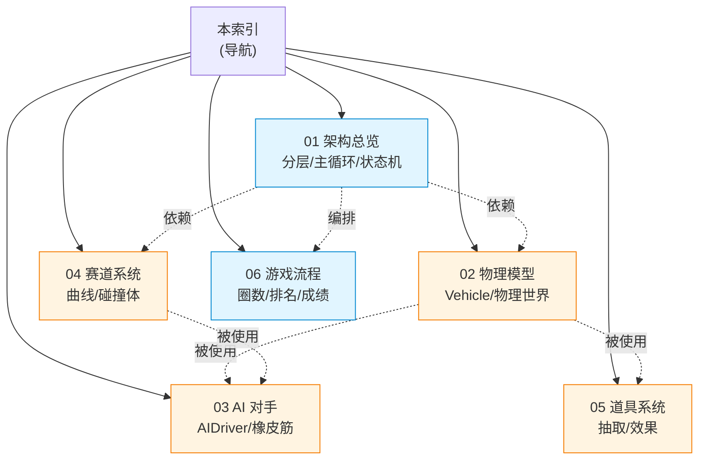

# Just For Speed — 设计文档集

> 本文档集对 **Just For Speed**（浏览器街机赛车游戏）的现有实现进行**逆向文档化**：忠实记录代码中已实现的算法、数据结构与架构设计，作为开发者理解「系统为什么这样设计」的参考。所有内容以当前代码为准；若代码与文档冲突，以代码为准。

## 项目一句话定位

使用 Three.js 渲染、cannon-es 物理模拟的第一视角街机赛车游戏，Low-poly 风格，支持键盘/手柄，含 3 条赛道、5 名 AI 对手、道具系统与 localStorage 成绩持久化。手感偏向街机娱乐（类似《马力欧卡丁车》），而非拟真模拟。

## 文档清单

| 编号 | 文档 | 一句话职责 |
|------|------|-----------|
| 01 | [架构总览](./01-architecture.md) | 分层架构、固定步长主循环、状态机、生命周期管理 |
| 02 | [物理模型](./02-physics.md) | RaycastVehicle 原理、车辆参数、-Z 朝向约定、漂移与翻车 |
| 03 | [AI 对手](./03-ai-opponents.md) | 曲线 progress 追踪、转向控制、橡皮筋机制 |
| 04 | [赛道系统](./04-track-system.md) | CatmullRom 样条、路面/护栏网格、201 Box 碰撞体、checkpoint |
| 05 | [道具系统](./05-items-system.md) | 加权随机抽取、4 种道具效果、命中判定、重生计时 |
| 06 | [游戏流程与数据](./06-game-flow.md) | 对局时序、圈数/排名算法、OOB 检测、成绩持久化 |

## 文档关系图

- 实线 = 导航入口；虚线 = 运行时依赖关系（如 AI 篇依赖物理篇的 Vehicle 与赛道篇的曲线）。
- 🔵 蓝色 = 结构性文档；🟠 橙色 = 算法密集文档。

## 推荐阅读路径

- **新人速览（理解整体）**：01 架构总览 → 06 游戏流程 → 选感兴趣的子系统深入。
- **核心算法（调参/改造手感）**：02 物理模型 → 03 AI 对手 → 05 道具系统。
- **想新增赛道**：04 赛道系统（末尾有接入清单）。
- **想改对局规则**：06 游戏流程（圈数/排名/成绩）。

## 阅读约定

- 文档语言为中文；代码标识符（类名、函数名、常量、字段）保留英文原文。
- 关键算法配有**公式**与**参数表**；关键实现配有**代码片段**（片段为讲解用途，可能与源码有精简，完整逻辑以源码为准）。
- 图表统一使用 **mermaid**（GitHub / 多数 Markdown 编辑器可直接渲染）。
- 文件引用格式：`src/physics/Vehicle.ts`，可在仓库中直接定位。
